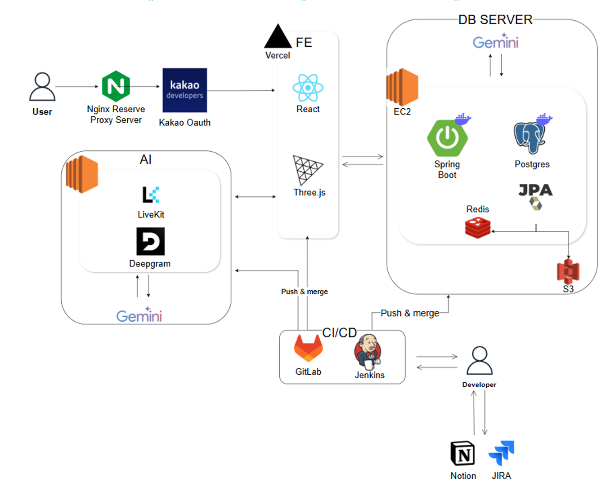
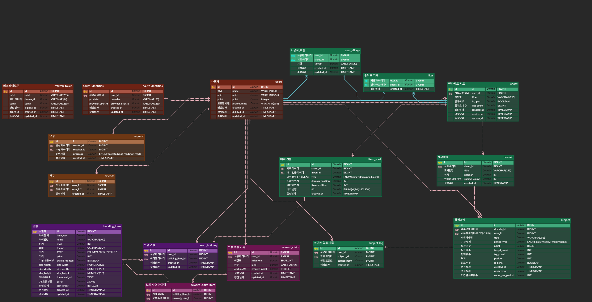

# 🍊 만다린 (Mandarin)

 

## 🍊 프로젝트 소개

**''' 목표를 실천하면 마을이 자랍니다 '''**

<b>새해마다</b> 계획을 세우지만, 그 계획표를 다시 열어본 적이 있으신가요?  
81칸을 혼자 채우려니 3칸도 못 가서 막히지는 않으셨나요?

<b>목표를 세워도</b> 오늘 뭘 해야 하는지 모르겠고,  
꾸준히 해도 눈에 보이는 게 없어 그만두게 되지는 않으셨나요?

이제 만다린과 함께라면, 계획을 세우는 것도 지키는 것도 즐거워집니다   
**AI 코치와 만다라트를 채우고, 매일의 과제가 나만의 3D 도시로 자라납니다.**

 

## 🍊 팀원 소개

| 정희성 | 황우찬 | 권병수 | 김재현 | 이성현 | 지상근 |
|:---:|:---:|:---:|:---:|:---:|:---:|
| **팀장** | **PM** | 팀원 | 팀원 | 팀원 | 팀원 |
| Infra · Back End | AI · Back End | Back End | Back End | Front End | Front End |

 
 

## 🍊 주요 기능

- **만다라트 작성**
  - 가운데 최종 목표 1개, 세부 목표 8개, 과제 64개로 이루어진 **9×9 계획표** 작성
  - 과제별 주기(일간 / 주간 / 월간 / 없음)와 목표 횟수 설정 및 공개/비공개 설정

- **AI 음성 코치**
  - **LiveKit** 기반 실시간 음성·텍스트 대화로 목표 설계
  - **Deepgram STT** 로 발화를 전사하고, **Gemini** 가 3단계 파이프라인(분류 → 후보 검색 → 판단)으로 과제 3개를 제안
  - 이미 담아둔 과제를 다시 말하면 새로 만들지 않고 **기존 과제를 지목**해 중복 방지
  - 마음에 드는 제안만 골라 만다라트 빈 칸에 바로 적용

- **오늘의 할 일**
  - 과제 주기에 맞춰 오늘 수행할 과제를 자동으로 모아 제공
  - 수행완료시 포인트 적립 

- **3D 마을**
  - **three.js** 3D 마을
  - 진행률이 오르면 **건물이 단계별로 성장**
  - 지형 및 배경 교체, 건물 배치·회전, 중앙 랜드마크 성장

- **상점 & 마일스톤 보상**
  - 적립한 포인트로 테마별 건물 구매
  - 진행률 12.5% 구간마다 포인트 혹은 랜드마크 지급

- **AI 주간 리포트**
  -  AI가 한 주의 수행 기록을 분석해 리포트 생성 

- **친구 & 리더보드**
  - 친구 코드로 검색·요청·수락, 친구의 공개 만다라트 열람
  - 포인트 기준 리더보드 랭킹

 
 

## 🍊 기술 스택

### **Frontend**

              

### **Backend**

               

### **AI**

        

### **CI/CD**

         

### **Communication**

    

 

## 🍊 시스템 아키텍처

 

## 🍊 ERD

 

## 🍊 산출물

- [요구사항명세서](./docs/assets/요구사항명세서.png)
- [기능명세서](./docs/assets/기능명세서.png)
- [API명세서](./docs/assets/API명세서.png)

- [와이어프레임](./docs/와이어프레임.pdf)
- [목업](./docs/목업.png)

- [중간 발표 자료](./docs/만다린_중간발표.pptx)
- [최종 발표 자료](./docs/최종PPTv7.pptx)

 

 

## 🍊 화면 구성
- [화면 구성 시나리오](./exec/시나리오.md)
