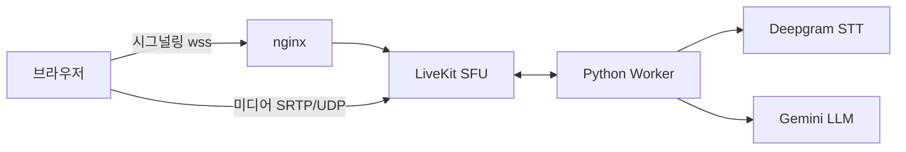
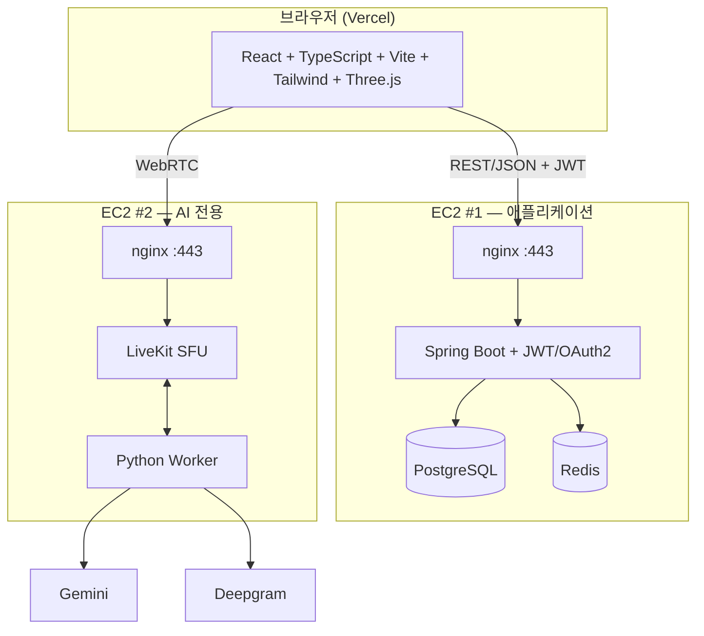
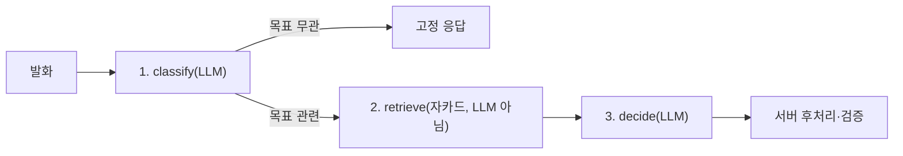

# 만다린(Mandarin) 데모데이 PPT 기획 — 이미지 위주 · 35장

> **한 줄 정의**: "목표를 말하면, 마을이 자란다" — AI와의 대화로 만다라트를 채우고, 실천할수록 나만의 3D 마을이 성장하는 목표관리 서비스.

> **용도**: SSAFY 공통 프로젝트 최종 발표(데모데이).
> **원칙**: 슬라이드 자체는 큰 이미지 1장 + 짧은 카피(제목급 문구, 1줄) 위주로 채우고, 설명은 발표자가 말로 합니다.
> 이 문서의 "발표 멘트" 항목은 슬라이드에 그대로 옮기지 말고 **말할 내용의 재료**로만 쓰세요.
> 이미지는 전부 `[이미지: ...]`로 자리만 비워뒀습니다 — 스크린샷은 나중에 채워 넣으시면 됩니다.

---

## 사용법

1. 아래 슬라이드를 순서대로 PPT 슬라이드 1장씩에 매핑하세요. 총 **35장**입니다(요청하신 30장 이상 충족).
2. `[이미지: ...]`는 무엇을 찍거나 가져와야 하는지 설명입니다. 괄호 안에 기존 `docs/` 자료로 대체 가능한 경우 표시해뒀습니다.
3. 각 섹션 끝의 "말할 때 조심할 것"은 `docs/발표-키워드.md`의 ⚠️ 항목을 그대로 반영한 것입니다 — 데모데이 Q&A에서 그대로 씁니다.
4. 외부 통계는 전부 실제 검색으로 찾은 출처입니다. 링크를 슬라이드 하단에 아주 작게 넣거나, 발표 노트에만 남겨도 됩니다.
5. 팀이 직접 진행한 설문조사(n=118, `docs/설문조사_응답_0731.xlsx`) 결과는 7번·11번 슬라이드에 반영했습니다. 원자료 전체 통계는 **부록 E**에 정리했습니다.
6. **23번은 라이브 데모 슬롯입니다.** 슬라이드가 아니라 실제 앱을 띄우는 시간이니, 리허설 때 반드시 시간을 재보세요(목표 60초). 데모 실패에 대비한 백업 영상 준비는 부록 F를 참고하세요.

---

## 목차 (섹션별 슬라이드 수)

| 섹션 | 슬라이드 | 장수 |
|---|---|---|
| 0. 오프닝 | 1~2 | 2 |
| 1. 문제 정의 (Why) | 3~7 | 5 |
| 2. 솔루션 개요 | 8~11 | 4 |
| 3. 핵심 기능 — 만다라트 | 12~14 | 3 |
| 4. 핵심 기능 — AI 코치 | 15~20 | 6 |
| 5. 핵심 기능 — 3D 마을 게임화 (**23번 = 라이브 데모**) | 21~26 | 6 |
| 6. 부가 기능 | 27 | 1 |
| 7. 기술 아키텍처 | 28~31 | 4 |
| 8. 성과 · 회고 | 32~34 | 3 |
| 9. 클로징 | 35 | 1 |
| **합계** | | **35** |

**시간 배분 가이드** (발표 8분 기준): 오프닝 20초 · 문제 정의 70초 · 솔루션 개요 50초 · 만다라트 40초 · AI 코치 90초 · **라이브 데모 60초** · 게임화 60초 · 기술 70초 · 회고 30초 · 클로징 10초.

---

## 디자인 시스템 — 색·타이포·구도

35장을 한 톤으로 묶기 위한 규칙입니다. **미리보기 아티팩트**에서 색상 스와치와 5개 템플릿 구도를 실제로 볼 수 있습니다.
→ **https://claude.ai/code/artifact/1936669b-2d8c-4b9d-a3fc-1414a4f02af8**
> ⚠️ 이 링크는 개인 계정 비공개일 수 있어 팀원이 못 열 수도 있습니다. 발표 전에 캡처해서 `docs/`에 PNG로 커밋해두세요.

새 색을 만들지 않고 실제 서비스 UI 토큰(`frontend/src/index.css`)에서 그대로 가져왔습니다. 배경은 **완전한 흰색**입니다 — 앱도 최근 커밋(`7cd437a style: 페이지 바탕을 흰색으로 통일`)에서 같은 흰색으로 바꿨으니 그 결정을 그대로 따릅니다.

### 색상

| 역할 | 값 | 쓰는 곳 |
|---|---|---|
| 브랜드 오렌지(강조) | `#f75316` | 핵심 숫자, 화살표, 강조 한 곳에만 — 남발 금지 |
| 슬라이드 배경 | `#ffffff` | 모든 슬라이드 바탕. 완전 흰색 |
| 카드 표면 | `#ffffff` | 배경과 같은 흰색. **색을 채우지 말고 테두리(`#e6e2db`, 1px)+그림자로만** 카드를 띄웁니다 — 배경과 카드를 색으로 구분하던 예전 방식을 앱이 최근 버렸습니다 |
| sunken(빈 자리) | `#f2f0ec` | 스크린샷을 아직 못 채운 placeholder 박스, 비교 슬라이드의 "Before" 쪽 배경 |
| 본문 텍스트 | `#1a1815` | 순수 검정 대신 웜톤 잉크 |
| 보조 텍스트 | `#7c746a` | 캡션, 출처, "idle 기준" 같은 조건 표기 |
| 브랜드 소프트(웨시) | `#fff4ed` | 비교 슬라이드의 "After" 배경 등 옅은 강조 |

카드 그림자 값(PowerPoint에서 도형 효과로 재현 시): `0 1px 2px rgba(26,24,21,0.04), 0 8px 24px rgba(26,24,21,0.12)` — 흐림 반경 크게, 투명도 낮게. PPT의 "도형 서식 → 그림자 → 미리 설정 → 오프셋: 가운데, 흐리게: 20px, 투명도: 88%" 정도가 가장 근접합니다.

**카테고리 색**(3요소 아이콘, 기술스택 4그룹처럼 여러 개를 구분해야 할 때만) — 이 순서 그대로: 오렌지 `#e8590c` → 블루 `#1971c2` → 그린 `#2f9e44` → 바이올렛 `#5f3dc4` → (필요 시) 핑크 `#c2255c`. 색맹 대비 검증을 통과한 순서라 임의로 바꾸지 마세요. 5개 넘게 필요하면 색을 더 만들지 말고 표나 소그룹으로 접습니다.

### 타이포그래피

`Downloads/NanumSquareNeo`에 이미 받아두신 **나눔스퀘어네오**를 씁니다. 굵기 3개만 쓰면 충분합니다.

| 역할 | 굵기 | 크기 |
|---|---|---|
| 슬라이드 헤드카피 | ExtraBold (`dEb`) | 36~44px |
| 통계 카드 큰 숫자 | Heavy (`eHv`) | 48~56px |
| 본문·발표 캡션 | Regular (`bRg`) | 16~18px |
| eyebrow·출처 표기 | Bold (`cBd`), 자간 0.08em | 11~13px |

PowerPoint에서 **파일 → 옵션 → 저장 → "파일에 글꼴 포함"**을 체크해야 다른 PC(발표 당일 노트북 등)에서도 글꼴이 깨지지 않습니다.

### 그리드 · 안전 영역

1920×1080 기준, 12컬럼 그리드, 사방 **96px(5%) 안전 영역**. 제목은 항상 안전 영역 안쪽 상단 1/5 띠에 배치하고, 이미지는 안전 영역을 넘어 풀블리드로 나가도 되지만 그 위에 텍스트를 얹을 때는 예외 없이 안전 영역 안에만 둡니다.

### 레이아웃 템플릿 5종

| 템플릿 | 구도 | 규칙 |
|---|---|---|
| **A. 풀블리드 히어로** | 이미지가 프레임 전체, 카피 3줄 이하가 우하단에 얹힘 | 텍스트 아래는 항상 어두운 그라디언트 스크림 |
| **B. 스크린샷 카드** | 상단 20% 캡션 띠(eyebrow+헤드카피) + 하단 80% 스크린샷 카드 1장 | 카드는 흰 배경에 12px 라운드 + 테두리 + 은은한 그림자(색을 채우지 않음). 스크린샷을 아직 못 구했으면 이 자리를 sunken 회색(`#f2f0ec`) placeholder로 비워둡니다 |
| **C. 다이어그램/플로우** | 중앙에 노드-화살표 다이어그램 | 노드는 채움 없이 선(1.5px)만, 화살표만 브랜드 오렌지 |
| **D. 통계 카드 그리드** | 1~4개 카드를 그리드로 배치 | 카드는 흰 배경+테두리+그림자(B와 동일 원칙). 숫자만 브랜드 오렌지, 라벨·조건은 회색 보조텍스트로 톤 분리 |
| **E. 비교/대비** | 좌우 2분할, 가운데 얇은 구분선 | 좌측(Before)은 중립 회색, 우측(After)만 브랜드 소프트 웨시 |

### 슬라이드별 템플릿 매핑

같은 템플릿이 3장 넘게 연속되지 않도록 배치했습니다(특히 만다라트·AI 코치 섹션).

| # | 슬라이드 | 템플릿 |
|---|---|---|
| 1 | 표지 | A |
| 2 | 팀 소개 | D (인물 카드 그리드) |
| 3 | Hook — 실패하는 목표 & 그래도 계속 세운다 | A |
| 4 | 의지가 아니라 구조 | E |
| 5 | 기존 목표관리 도구의 한계 | D (자체 제작 UI 목업 + 설문 수치) |
| 6 | **왜 하필 만다라트인가** | D (프레임워크 비교표 + 이유 카드 3장) |
| 7 | 설문 — 문제 검증 | D |
| 8 | 만다린이란 | C |
| 9 | 핵심 3요소 | D (3분할 카드) |
| 10 | 사용자 여정 | C |
| 11 | 컨셉 반응(설문) | D |
| 12 | 만다라트란 + 우리 UI | **E** (좌: 개념 도해 / 우: 실제 화면) |
| 13 | 목표→도메인→과제 | B |
| 14 | 진행 관리 | B |
| 15 | AI 코치 소개 | B |
| 16 | 왜 음성 대화인가 | **A** (마이크 켠 화면 풀블리드) |
| 17 | AI 과제 생성 과정 | B |
| 18 | 중복 방지 | **C** (자카드 흐름 도해 + 화면 인서트) |
| 19 | 환각 방지 | B |
| 20 | 실시간 음성 아키텍처 | C |
| 21 | 왜 게임화인가 | D |
| 22 | 나만의 3D 마을 | A |
| 23 | **🔴 라이브 데모** | (슬라이드 없음 — 화면 전환용 표지 1장만) |
| 24 | 마을 성장 | E |
| 25 | 테마 꾸미기 | D (콜라주 그리드) |
| 26 | 친구·리더보드 | B |
| 27 | 주간 AI 리포트 · 마이페이지 | B (2분할) |
| 28 | 전체 시스템 구성 + 기술 스택 | C (도식 노드에 로고 배치) |
| 29 | AI 파이프라인 3단계 | C |
| 30 | 보안 | B |
| 31 | 신뢰할 수 없는 LLM & 테스트 | D |
| 32 | 실측 지표 | D |
| 33 | 트러블슈팅 | D (카드 3단) |
| 34 | 앞으로 할 일 | C (로드맵) |
| 35 | 마무리 | A |

---

## 0. 오프닝

### 1. 표지
- **온슬라이드 카피**: `만다린` + 한 줄 태그라인 후보 3개 중 택1
  - "목표는 세우는 것보다 계속하는 게 어렵다"
  - "혼자 세우고, 함께 키우는 목표"
  - "만다라트 × AI 코치 × 나만의 마을"
- **이미지**: [이미지: 앱 메인 화면 풀샷 또는 3D 마을 뷰 — 가장 예쁜 스크린샷 1장. 없으면 `docs/목업.png` 임시 사용]
- **발표 멘트**: 팀명(D106), SSAFY 15기 공통 프로젝트, 개발 기간(2026-07-16 ~ 08-06, 약 3주) 언급.

### 2. 팀 소개
- **온슬라이드 카피**: 팀원 이름 + 역할(FE/BE/AI/인프라 등, 본인 기준으로 채워주세요)
- **이미지**: [이미지: 팀 로고 또는 팀원 아이콘/캐릭터 6개 — 3D 마을 캐릭터 에셋 재활용 추천]
- **발표 멘트**: 6명 팀(권병수, 김재현, 이성현, 정희성, 지상근, 황우찬), 역할 분담 한 줄씩.

---

## 1. 문제 정의 (Why)

### 3. Hook — 목표는 왜 항상 실패하나 (그래도 우리는 계속 세운다)
- **온슬라이드 카피**: `"새해 목표, 92%는 실패합니다"` + 하단 작게 `그런데도 '갓생'은 계속된다`
- **이미지**: [이미지: 텅 빈 다이어리 / 체크 안 된 투두리스트 감성 이미지를 메인으로, 우하단에 미라클모닝·스터디 인증 SNS 피드 콜라주를 작게 겹쳐 배치]
- **발표 멘트·데이터** (수치는 강한 것부터 — 시간 없으면 ①③만)
  - **① 언제 포기하는지까지 데이터가 있습니다.** 운동 기록 앱 **Strava가 8.2억 건의 활동 기록을 분석**한 결과, 새해 목표를 세운 사람들이 가장 많이 그만두는 날은 **1월 셋째 주**였습니다. 이 날을 **"Quitter's Day(포기의 날)"**라고 부릅니다 — 새해 결심이 **채 3주를 못 갑니다.** ([Inc. 보도](https://www.inc.com/jeff-haden/a-study-of-800-million-activities-predicts-most-new-years-resolutions-will-be-abandoned-on-january-19-how-you-cancreate-new-habits-that-actually-stick.html), 2019년 Strava 데이터)
  - **②** 스크랜턴 대학교(University of Scranton) 및 Statistic Brain 조사 — 새해 목표를 세운 사람 중 **약 8~9%만 성공**. ([관련 기사](https://www.dailypop.kr/news/articleView.html?idxno=96026), [분석글](https://brunch.co.kr/@habittogether/23))
  - **③ 그런데도 사람들은 계속 목표를 세웁니다 — 그것도 아주 많이.** 대학내일20대연구소가 만 15~39세 **900명**을 조사한 결과, **77.2%가 "매일 실천하려고 노력하는 루틴이 있다"**고 답했고 **1인당 평균 2.2개**의 루틴을 실천 중이었습니다. 더 중요한 건 이겁니다 — **70.3%가 "사소한 성취도 내 삶에 큰 의미가 된다"**, **65.8%가 "대단한 목표는 필요 없다"**고 답했습니다. ([보도자료](https://www.newswire.co.kr/newsRead.php?no=920162), n=900, 2020-11 온라인 패널조사)
  - **④** 이런 흐름을 **'갓생(God+人生)'**이라 부릅니다 — 미라클모닝·스터디 인증 챌린지의 확산. ([관련 기사](https://plus.hankyung.com/apps/newsinside.view?aid=202211212467d))
  - **연결 문장**: **"의지가 없어서가 아닙니다. 10명 중 8명이 이미 매일 뭔가를 하려 하고 있고, 사소한 성취에서 의미를 찾고 있습니다. 없는 건 3주를 넘겨 계속하게 해주는 구조입니다."** → 다음 슬라이드로.
  - 뒤(7번 슬라이드)에서 우리 팀이 직접 확인한 수치도 이어서 보여줌.

> 📌 **이 슬라이드가 데이터로 하는 일**: ①③을 붙여 놓으면 "사람들은 의욕이 없다"가 아니라 **"의욕은 넘치는데 3주를 못 넘긴다"**는 정확한 문제 정의가 됩니다. 그리고 ③의 "사소한 성취 70.3%"는 뒤에서 3D 마을 게임화(21번)의 직접 근거가 되니, 여기서 한 번 심어두고 21번에서 회수하세요.

> 📌 이 슬라이드는 기존 3번(실패 통계)과 4번(갓생 트렌드)을 합친 것입니다. 두 장 다 "사람들이 목표에 진심이다"라는 같은 메시지라 한 장에서 대비 구조로 말하는 편이 강합니다.

### 4. 문제는 "의지"가 아니라 "구조"
- **온슬라이드 카피**: `습관이 되기까지 평균 66일, 사람들은 21일에 포기한다`
- **이미지**: [이미지: 가로 타임라인 1개. 0일 ─── **21일(대부분 포기)** ─── **66일(습관 형성 평균)** ─── 254일(최장). 21일 지점에 회색 X, 66일 지점에 브랜드 오렌지 깃발. 그 아래 작게 "운동하기" 같은 막연한 목표 vs 세분화된 실천과제 대비 도해]
- **발표 멘트·데이터**
  - **① 핵심 수치 — 66일.** 런던대(UCL) Phillippa Lally 연구팀이 **96명을 12주간 추적**한 결과, 어떤 행동이 자동적인 습관으로 자리 잡는 데 걸린 시간은 **평균 66일**이었습니다. 흔히 말하는 "21일이면 습관이 된다"는 근거 없는 통설이고, 실제 범위는 **18일에서 254일**까지 벌어졌습니다. ([Lally et al., 2010, *European Journal of Social Psychology*](https://doi.org/10.1002/ejsp.674), [UCL·서리대 인터뷰](https://www.surrey.ac.uk/news/does-it-really-take-66-days-form-habit-we-asked-expert-dr-pippa-lally))
  - **② 앞 슬라이드와 붙이면 결론이 나옵니다.** 습관이 되기까지 **평균 66일**이 필요한데, 사람들은 **3주(≈21일)**에 그만둡니다. **이 45일의 간극이 우리가 푸는 문제입니다.** 의지의 문제가 아니라, 그 기간을 버티게 해줄 장치가 없는 겁니다.
  - **③ 그럼 무엇이 버티게 하나 — 구체화.** 심리학자 Peter Gollwitzer의 "실행 의도(implementation intentions)" 연구에 따르면, 막연한 목표보다 "언제·어디서·무엇을"까지 구체화한 목표의 달성률이 유의미하게 높습니다(**94개 연구 메타분석, 효과크기 d=.65** — 사회심리학에서 중간~큰 효과). ([Gollwitzer & Sheeran, 2006](https://doi.org/10.1016/S0065-2601(06)38002-1))
  - 우리 자체 설문(7번 슬라이드)에서도 목표 포기 이유 중 "막막함/시작장벽"이 25%로 나와 같은 방향을 가리킴 — 7번에서 바로 이어서 수치로 확인시켜 줄 것.

> 📌 **66일은 이 발표에서 가장 값싸고 강한 숫자입니다.** peer-reviewed 저널에 DOI까지 있어 반박이 어렵고, "21일 통설"을 깨는 반전이라 청중이 기억합니다. 그리고 **"66일 - 21일 = 45일의 간극"**이라는 프레임 하나로 만다라트(세분화)·AI(코칭)·마을(지속 동기)이 왜 전부 필요한지가 설명됩니다. 시간이 없어 슬라이드를 더 줄여야 한다면, 이 장은 남기세요.

### 5. 기존 목표관리 도구의 한계
- **온슬라이드 카피**: `한 달 뒤, 10명 중 9명은 앱을 떠난다`
- **이미지**: [이미지: 좌측 40% — 리텐션 감쇠 곡선 1개(Day1 → Day7 → Day30으로 급락, Day30 지점만 브랜드 오렌지). 우측 60% — 우리가 자체 제작한 "전형적인 텍스트 나열형 체크리스트" 목업 2~3개(브랜드명·로고 없이 UI 패턴만 재현)와 통계 카드. 실제 서비스 UI를 그대로 캡처해 비교하면 특정 제품을 저격하는 것처럼 보일 수 있어 지양]
- **발표 멘트·데이터** (③이 가장 강합니다 — 시간 없으면 ③만)
  - **③ 기존 도구는 실제로 사람을 붙잡지 못합니다.** 모바일 앱 리텐션 벤치마크에 따르면 **전체 앱의 Day-30 잔존율은 4~8%** 수준이고, **생산성(productivity) 앱도 평균 4%대**입니다. **가장 잘하는 상위권 생산성 앱조차 12~18%**에 그칩니다 — 업계 최고 수준의 앱도 **한 달 뒤엔 10명 중 8명 이상이 떠난다**는 뜻입니다. ([UXCam 벤치마크](https://uxcam.com/blog/mobile-app-retention-benchmarks/), [Userpilot](https://userpilot.com/blog/mobile-app-retention/) — AppsFlyer·Adjust·data.ai 집계 기반)
    - ⚠️ **조건 병기**: "출처마다 4%에서 18%까지 갈리는데, **어느 쪽을 택해도 결론은 같습니다** — 대다수가 한 달을 못 넘깁니다." 이렇게 말하면 숫자를 유리하게 고른 게 아니라는 인상을 줍니다.
    - **4번 슬라이드와 연결**: 습관이 되는 데 66일이 필요한데 **앱은 30일도 못 버팁니다.** 도구가 습관보다 먼저 죽습니다.
  - **근거 ① — 사람들은 전용 도구를 안 쓰고 범용 도구로 때웁니다.** 자체 설문에서 목표·할 일 관리에 쓰는 도구 1위는 **캘린더 67%**, 2위 다이어리/노트 39%였고, 정작 **습관 트래커는 20%, 만다라트는 4%**에 그쳤습니다. 목표관리 전용 도구가 일상에 자리 잡지 못했다는 뜻입니다.
  - **근거 ② — 도구를 써도 성취가 안 느껴집니다.** 목표를 포기한 이유 3위가 **"성취감 부족" 30%**(부록 E). 체크박스를 지우는 것만으로는 성장한 느낌이 안 남는다는 신호입니다.
  - 마무리: 텍스트 나열형 UI, 성취를 시각적으로 못 느낌, 지속 동기부여 장치 부재 — 특정 앱을 지목하지 않고 **"많은 목표관리 앱이 공통적으로 가진 패턴"**으로 일반화해서 말하기.

> 📌 이전 버전은 "투두앱 미사용 54%"를 근거로 썼는데, 설문에서 **안 쓰는 이유를 묻지 않았기 때문에** "재미가 없어서"의 근거가 되지 못합니다(그냥 필요를 못 느꼈을 수도 있음). Q&A에서 반박당하기 쉬워 위 두 근거로 교체했습니다. 54%는 "전용 도구 미정착"의 보조 수치로만 곁들이세요.

### 6. 왜 하필 만다라트인가

> 🔴 **이 슬라이드는 반드시 준비하세요.** 심사위원이 가장 찌르기 쉬운 질문이 **"목표관리 프레임워크가 SMART·OKR·GTD 등 많은데 왜 만다라트죠? 유명인이 썼다는 것 말고 이유가 있나요?"**입니다. "오타니가 썼으니까"는 일화지 근거가 아닙니다. 아래 세 가지가 진짜 답입니다.

- **온슬라이드 카피**: `세분화를 강제하고, AI가 검증 가능하고, 성장이 자동 계산되는 유일한 구조`
- **템플릿**: **D** — 비교표 1개 + 이유 카드 3장
- **이미지**: [이미지: 상단 — 프레임워크 비교표(아래 표). 하단 — 이유 3장 카드. 만다라트 열(column)만 브랜드 소프트 웨시 `#fff4ed` 배경으로 강조]

**프레임워크 비교표** (슬라이드에는 ✅/△/❌ 기호만, 설명은 말로)

| | SMART | OKR | 습관 트래커 | **만다라트** |
|---|---|---|---|---|
| 세분화를 **강제**하나 | ❌ 문장 1개면 끝 | △ KR 3~5개 권장 | ❌ 항목 나열 | ✅ **8 × 8 = 64칸이 미리 존재** |
| 전체를 **한 화면**에 | ❌ | △ | ❌ 스크롤 | ✅ **9×9 한 장** |
| 진행률 **자동 계산** | ❌ 분모 없음 | △ 수동 % 입력 | △ 연속일만 | ✅ **완료수 / 64** |
| AI가 채우기 **적합**한가 | ❌ 자유 서술 | ❌ 자유 서술 | ❌ | ✅ **빈 칸이 명시적** |

- **발표 멘트 — 이유 세 가지**
  - **① 세분화를 "권장"이 아니라 "강제"합니다.** 4번 슬라이드에서 실행 의도 연구(d=.65)를 근거로 세분화가 답이라고 했는데, 문제는 **아무도 스스로 세분화하지 않는다**는 겁니다. SMART는 "구체적으로 쓰세요"라고 말할 뿐이라 대부분 한 문장 쓰고 끝냅니다. 만다라트는 **빈 칸 64개가 먼저 있고**, 사람은 빈 칸을 보면 채우려 합니다. 세분화가 사용자의 의지가 아니라 **구조의 결과**가 됩니다.
  - **② 성취가 자동으로 계산됩니다.** 7번 슬라이드의 "성취감 부족 30%"를 풀려면 진척을 보여줘야 하는데, **자유 목록에는 분모가 없습니다.** 오늘 3개 했으면 "3개 중 3개"인지 "100개 중 3개"인지 알 수 없죠. 만다라트는 **분모가 64로 고정**돼 있어서 진행률이 계산되고, 그래서 **3D 마을이 자랄 근거**가 나옵니다. (실제로 저희 서버가 `64개 과제의 평균 진행률`을 계산해 내려줍니다 — `frontend/src/data/types.ts:78`)
  - **③ ★ 가장 중요 — AI를 안전하게 쓸 수 있는 유일한 구조였습니다.** 이건 뒤 기술 섹션(31번)에서 회수할 예정이니 여기선 한 줄만: **"칸이 유한하고 셀 수 있어서, AI가 지어낸 것을 서버가 판정할 수 있습니다."** 자유 서술형 목표였다면 이게 불가능합니다.
  - **보조 사례**: 오타니 쇼헤이가 고교 1학년 때 작성한 9×9 계획표가 실제 목표 달성으로 이어진 유명 사례가 있습니다 — **다만 이건 근거가 아니라 "익숙한 예시"로만 씁니다.** 실물은 12번 슬라이드에서 보여줍니다. ([기사1](https://insightpress.kr/mandalart-chart-goal-setting-ohtani-method/), [기사2](https://heraldk.com/2024/12/31/%E2%80%9C2025%EB%85%84-%EA%B3%84%ED%9A%8D-%EC%84%B8%EC%9A%B0%EA%B8%B0-%EC%A0%84-%EA%BC%AD-%EB%B3%B4%EB%9D%BC%E2%80%9D%E2%80%A6%EC%98%A4%ED%83%80%EB%8B%88-%EA%B3%84%ED%9A%8D%ED%91%9C-%EB%8C%80%EC%B2%B4/))
  - **인지도 역설(시간 되면)**: 만다라트는 1970~80년대 일본에서 고안된 오래된 기법인데(고안자에 대해선 마쓰무라 야스오/이마이즈미 히로아키 두 설이 있어 **단정하지 마세요**), 우리 설문에서 **51%가 "처음 들어봤다"**고 답했습니다. 좋은 구조인데 안 퍼진 이유는 **81칸을 혼자 채우는 게 어렵기 때문**입니다. 그게 다음 장(AI)으로 넘어가는 다리입니다.

> 📌 **이 슬라이드의 진짜 메시지**: 만다라트를 고른 건 취향이 아니라, **AI와 게임화를 붙일 수 있는 유일한 구조**였기 때문입니다. 세 요소가 "그냥 다 넣은 것"이 아니라 **서로를 필요로 한다**는 걸 여기서 못 박아야 뒤 섹션이 설득됩니다 —
> **만다라트는 AI 없이는 진입장벽이 높고(81칸), AI는 만다라트 없이는 출력을 검증할 구조가 없고, 게임화는 만다라트 없이는 성장을 계산할 분모가 없습니다.**

### 7. 우리가 직접 확인했습니다 — 자체 설문 118명
- **온슬라이드 카피**: `설문 118명 · 목표 완수율 50% 미만 56%`
- **이미지**: [이미지: 막대그래프 2개 — ① 최근 1년 목표 완수 비율 분포(0~25% 15% / 25~50% 41% / 50~75% 31% / 75%이상 13%) ② 목표 포기 이유(목표를 잊어버림 47%, 시간 부족 42%, **성취감 부족 30%**, **막막함/시작장벽 25%**). 데이터는 부록 E 참고. **3위·4위 막대만 브랜드 오렌지로 강조**하고 1·2위는 회색으로 — 우리가 정면으로 푸는 문제가 그 둘이라는 걸 색으로 말합니다]
- **발표 멘트·데이터**: 팀이 직접 진행한 자체 설문(n=118, 2026-07-31 마감, `docs/설문조사_응답_0731.xlsx`). 최근 1년간 세운 목표를 **절반도 못 지켰다는 응답이 56%**(0~25% 15% + 25~50% 41%).
- **포기 이유 → 우리 기능 대응** (이 매핑을 여기서 못 박고 넘어가면 이후 섹션이 전부 "약속을 지키는" 구조가 됩니다)

  | 포기 이유 | 우리의 대응 |
  |---|---|
  | 성취감 부족 30% | **3D 마을 게임화** — 실천이 눈에 보이는 성장으로 (21~26번) |
  | 막막함/시작장벽 25% | **만다라트 세분화 + AI 대화** — 무엇부터 할지를 대신 쪼개줌 (12~20번) |

- **추가 인사이트(발표자용, 시간 되면 언급) — 만다라트의 진입장벽은 "채우는 행위" 자체입니다**
  - 만다라트를 **"처음 들어봤다"는 응답이 51%**로 절반 이상 — 인지도 자체가 낮습니다.
  - 안 써본 사람에게 **왜 안 썼는지**를 물었더니(복수응답), 1위는 단순 무관심(48%)이었지만 **2위 "어떻게 채워야 할지 모름" 29%**, **3위 "81칸이 부담스러움" 23%**로, **2·3위가 나란히 "채우는 행위"에 대한 부담**이었습니다.
  - **→ 결론**: 만다라트가 안 퍼진 이유는 기법이 나빠서가 아니라 **혼자 채우기 어렵기 때문**입니다. 그리고 **저희 AI가 정확히 이 두 가지를 대신합니다** — "어떻게 채울지"는 대화가 안내하고, "81칸의 부담"은 말 한마디당 한 칸씩 줄어듭니다.

  > ⚠️ **말할 때 하면 안 되는 것 두 가지**
  > **① 29% + 23% = 52%로 합산하지 마세요.** 복수응답 문항이라 두 개를 동시에 고른 사람이 중복 계산됩니다. **"2위와 3위가 둘 다 채우기 부담"**이라고만 말하면 정확하고, 메시지는 그대로 전달됩니다.
  > **② "경험자는 2.35점인데 비경험자는 23%"라는 식으로 대비하지 마세요.** 앞은 **5점 척도 평균**이고 뒤는 **복수응답 비율**이라 **애초에 비교할 수 없는 두 척도**입니다. 청중이 헷갈리고, 눈치 빠른 심사위원에겐 숫자를 억지로 붙였다는 인상을 줍니다.

  - **경험자 점수(2.35/5)를 굳이 쓰고 싶다면** — 대비가 아니라 **독립된 보조 관찰**로만, 그리고 아래 한계를 반드시 붙여서 말하세요.
    - 써본 사람(**n=23**)이 매긴 "81칸 채우기 부담"은 평균 **2.35/5**로 낮았습니다.
    - ⚠️ 다만 **끝까지 써본 사람만 응답했으므로 생존 편향이 있습니다** — 부담을 크게 느낀 사람은 애초에 "실제 사용" 집단에 남아 있지 않습니다. **n=23은 표본도 작습니다.**
    - 그래서 이 숫자는 **"실제로 해보면 생각만큼 어렵지 않을 수도 있다"는 힌트** 정도로만 쓰고, **근거로 내세우지는 마세요.** 위의 29%·23%만으로 논지는 충분히 섭니다.

**말할 때 조심할 것**: 8% 통계는 미국 조사(Statistic Brain / Univ. of Scranton) 기반이고, 118명 설문은 SSAFY 교육생 위주 표본(무작위 아님, 자기선택편향 가능)입니다. "전국 조사 결과"나 "국내 통계로는"이라고 뭉뚱그리지 말고 각각 출처를 정확히 말할 것.

---

## 2. 솔루션 개요

### 8. 만다린이란
- **온슬라이드 카피**: `만다라트로 세우고, AI와 대화하며 채우고, 마을로 키운다`
- **이미지**: [이미지: 서비스 3요소를 아이콘 3개로 배치한 심플 다이어그램]
- **발표 멘트**: 한 문장 엘리베이터 피치.

### 9. 핵심 3요소
- **온슬라이드 카피**: `만다라트 시트 · AI 코치 · 3D 마을`
- **이미지**: [이미지: 3분할 레이아웃 — 만다라트 그리드 스크린샷 / AI 코치 채팅 스크린샷 / 3D 마을 스크린샷]
- **발표 멘트**: 각 요소를 한 줄씩 티저로 언급하고 이후 섹션에서 상세 설명 예고.

### 10. 사용자 여정 한눈에
- **온슬라이드 카피**: `가입 → 목표 설계 → AI 대화 → 실천 → 마을 성장 → 리포트`
- **이미지**: [이미지: `docs/플로우차트.png` 재활용 또는 재디자인한 여정 다이어그램]
- **발표 멘트**: 전체 사용 흐름을 15초 안에 훑기.

### 11. 컨셉 반응은 뜨거웠다
- **온슬라이드 카피**: `컨셉 매력도 5점 만점에 4.21` (큰 글씨) + 아래 한 줄 `그리고 95%가 "출시되면 써보겠다"` (작게)
  > ⚠️ **`매력도 4.21 · 동기부여 4.19 · 사용 의향 95%`처럼 한 줄에 나열하지 마세요.** 앞의 둘은 **5점 척도 평균**이고 95%는 **예/아니오 비율**이라, 나열하면 "4.21, 4.19, 95"가 같은 축의 숫자처럼 읽힙니다. 위처럼 **문장을 끊어서** 척도를 분리하세요. 차트도 같은 이유로 막대와 도넛 미터를 갈라 놓았습니다.
- **이미지**: 막대 4개(5점 척도 평균) + 원형 미터 1개(사용 의향 95%) 조합 차트. **완성된 목업을 아래 아티팩트로 만들어뒀습니다 — 색상 hex 값까지 그대로 캡처해서 쓰시면 됩니다.**
  → **https://claude.ai/code/artifact/8d09dde5-bf56-46b2-b2de-bea051f9c91e**
  > ⚠️ 위와 동일 — 발표 전 PNG로 뽑아 `docs/`에 커밋해두세요.

  **레이아웃** (16:9, 좌 58% : 우 42% 2단 분할)
  - 좌측: 가로 막대 **3개**, 내림차순(매력도 4.21 → 동기부여 4.19 → AI신뢰도 3.66). 막대 두께 24px, 끝은 4px 라운드. 척도 3점(보통) 위치에 점선 기준선 — "전부 보통 이상"이라는 걸 한눈에 보여줌. 값 라벨은 막대 끝에 직접 표기(4.21 등), 항목명은 막대 위에 왼쪽 정렬로 작게.
    > ⚠️ 아티팩트 목업에는 막대가 4개로 그려져 있습니다. **3개로 줄여서 쓰세요.**
  - 우측: 원형 도넛 미터, 안에 큰 숫자 **95%** + 아래 작은 글씨로 "112 / 118명", 미터 아래 라벨 "서비스 출시 시 사용 의향". 세로 구분선(연한 회색 1px)으로 좌/우 분리.
  - 하단: 얇은 회색 선 + "자체 설문조사 · SSAFY 교육생 대상 · n=118 · 2026-07-31 마감" 출처 캡션(11~12px, muted).
  - 상단: 작은 eyebrow "자체 설문조사 · n=118" + 슬라이드 제목.

  **색상** (다크모드 대응 값도 있으니 발표 환경에 맞는 쪽 사용)
  | 요소 | 라이트 | 다크 |
  |---|---|---|
  | 막대 4개(전부 동일 색 — 값 차이는 길이로만 표현, 색으로 순위를 매기지 않음) | `#2a78d6` (블루) | `#3987e5` |
  | 미터 채움(오렌지 — 막대와 다른 지표 축이라 다음 계열색 사용) | `#eb6834` | `#d95926` |
  | 미터 트랙(안 채워진 부분) | `#eb6834` 14% 투명도 | `#d95926` 18% 투명도 |
  | 배경(슬라이드 카드) | `#fcfcfb` | `#1a1a19` |
  | 본문 텍스트 | `#0b0b0b` | `#ffffff` |
  | 보조 텍스트(항목명) | `#52514e` | `#c3c2b7` |
  | 축/캡션(가장 흐림) | `#898781` | `#898781` |
  | 기준선(점선)·구분선 | `#c3c2b7` / `#e1e0d9` | `#383835` / `#2c2c2a` |

  막대 4개를 굳이 무지개색으로 안 칠한 이유: 4개 다 "같은 5점 척도로 물어본 질문"이라 하나의 시리즈로 보는 게 맞고, 낮은 값(AI신뢰도)에 다른 색을 쓰면 "얘만 나쁘다"는 인상을 과장하게 됩니다. 길이 차이만으로 충분히 전달돼서 색은 통일했습니다.
- **발표 멘트·데이터**: 같은 설문(n=118)에서 지금 방금 소개한 컨셉을 그대로 물어봤습니다. "체크리스트 대신 목표 달성 과정이 도시처럼 자라난다"는 컨셉 매력도 평균 **4.21/5**(4~5점 응답 88%), "지속 동기부여에 도움될 것 같다" 평균 **4.19/5**. "AI가 대화로 계획을 자동으로 짜준다"에 대한 신뢰도는 평균 **3.66/5**으로 다른 항목보다 낮은데, 이 격차가 19번 슬라이드(구조화 출력 + 서버 검증)를 설계한 이유. 서비스가 나오면 **95%가 "사용해보고 싶다"**고 응답.

---

## 3. 핵심 기능 — 만다라트

### 12. 만다라트란, 그리고 우리 앱에서는
- **온슬라이드 카피**: `9x9, 목표를 실행 가능한 단위로`
- **템플릿**: **E(좌우 2분할)** — 좌측 "원조", 우측 "우리"
  - **좌측(원조)**: [이미지: **오타니 쇼헤이 만다라트 계획표를 직접 재현한 9×9 표** — 부록 G-8의 재현 방법을 따를 것. 배경 sunken 회색. 빈 그리드 도해보다 실제 사례가 훨씬 잘 읽힙니다]
  - **우측(우리)**: [스크린샷 필요: `MandalartGrid` 컴포넌트 실제 화면 — 목표를 채운 상태. 배경 브랜드 소프트 웨시]
- **발표 멘트**: 중심 목표 1개 → 세부 목표 8개(도메인) → 각 도메인당 실천과제 8개 = 최대 64개 실천과제. **왼쪽이 오타니가 고교 1학년 때 손으로 채운 표이고, 오른쪽이 저희가 구현한 화면입니다** — 구조가 그대로 옮겨졌다는 걸 눈으로 보여주세요. 차이는 하나입니다: **왼쪽은 혼자 81칸을 채워야 했고, 오른쪽은 AI와 말로 채웁니다.** `DomainCell` 컴포넌트를 재사용해 9칸을 렌더링한다는 기술적 포인트는 기술 섹션에서.

> 📌 이전 13번(개념)과 14번(UI)을 합친 것입니다. 개념 설명만 한 장을 통째로 쓰기엔 아깝고, 개념→실제를 좌우로 붙이면 "그대로 구현했다"가 한눈에 보입니다. 만다라트 섹션이 B템플릿 4연속이던 문제도 같이 해결됩니다.

### 13. 목표 → 도메인 → 과제 구조
- **온슬라이드 카피**: `목표 1개 · 도메인 8개 · 과제 최대 8개씩`
- **이미지**: [스크린샷 필요: 목표 상세 페이지(SheetDetail) — 도메인별 과제 리스트 펼친 화면]
- **발표 멘트**: 반복 주기(매일/매주/없음, `Period` 타입) 설정 가능.

### 14. 진행 관리
- **온슬라이드 카피**: `체크 한 번으로 기록`
- **이미지**: [스크린샷 필요: 과제 체크/실천 기록 UI, 진행률 바(ProgressBar)]
- **발표 멘트**: 실천 기록이 리포트·마을 성장의 데이터 소스가 됨(다음 섹션들과 연결되는 포인트).

---

## 4. 핵심 기능 — AI 코치

### 15. AI 코치 소개
- **온슬라이드 카피**: `말로도, 글로도 — 목표를 함께 설계하는 AI`
- **이미지**: [스크린샷 필요: AiCoachPage 전체 화면 — 좌측 시트 패널 + 우측 대화창]
- **발표 멘트**: 텍스트+음성 입력, 응답은 텍스트만(TTS 의도적 미도입 — 이유는 다음 슬라이드).

### 16. 왜 음성 대화인가
- **온슬라이드 카피**: `타이핑보다 자연스럽게`
- **템플릿**: **A(풀블리드 히어로)** — 마이크 켜고 실시간 캡션이 뜨는 순간을 화면 전체로. 카피는 우하단에 스크림 얹어서.
- **이미지**: [스크린샷 필요: 마이크 버튼 활성 상태 + 실시간 캡션이 떠 있는 화면 — 가능하면 손가락이 마이크를 누르는 실사 각도로 찍으면 더 좋음]
- **발표 멘트**: WebRTC 기반 실시간 STT(Deepgram). 캡션은 interim(임시)/final(확정) 두 종류.

### 17. AI가 과제를 만들어주는 과정
- **온슬라이드 카피**: `대화 한 번 → 과제 후보 제안 → 담기`
- **이미지**: [스크린샷 필요: 대화 중 AI가 과제를 제안하고 "담기" 버튼이 뜨는 순간]
- **발표 멘트**: `mandarin.goal` payload로 구조화된 결과가 옴. 실제 발화당 응답 시간 **2.25~2.83초** (단일 사용자, 표본 3회 — 조건 꼭 같이 언급).

### 18. 중복 과제는 만들지 않는다
- **온슬라이드 카피**: `이미 있는 과제는 다시 만들지 않습니다`
- **템플릿**: **C(다이어그램)** — 중앙에 흐름 도해, 우하단에 실제 화면을 작은 인서트로.
- **이미지**: [이미지: `새 과제 후보 → 바이그램 분해 → 자카드 유사도 계산 → 상위 후보만 LLM에 전달 → 최종 판단` 5단 흐름도. 화살표만 브랜드 오렌지] + [스크린샷 인서트: "이미 담아둔 과제예요" 안내 문구가 뜨는 UI]
- **발표 멘트**: 바이그램 자카드 유사도(`|A∩B| / |A∪B|`)로 후보 검색 → LLM이 최종 판단. **벡터 DB 없이** 해결한 설계 포인트(`ai_livekit/HANDOFF.md` 3절 근거). 3주 프로젝트에서 인프라를 하나 덜 세운 판단.

### 19. AI는 없는 걸 지어내지 않는다
- **온슬라이드 카피**: `모르면 되묻는다, 지어내지 않는다`
- **이미지**: [이미지: 명확화 질문(clarify_question)이 오는 대화 스크린샷]
- **발표 멘트**: 구조화 출력(`responseSchema`)으로 형식 강제 + **확인 가능한 사실은 서버가 최종 판정**(새 도메인 여부, 기존 과제 제목). 프롬프트 인젝션 방어(태그 이스케이프)도 언급. 자체 설문(11번 슬라이드)에서 "AI가 계획을 자동으로 짜준다"에 대한 신뢰도가 3.66/5으로 다른 항목보다 낮게 나왔던 것과 바로 연결되는 슬라이드 — "그래서 이렇게 안전장치를 뒀다"는 흐름으로 말하면 설득력이 커짐.

### 20. 실시간 음성 아키텍처
- **온슬라이드 카피**: (다이어그램만, 텍스트 최소화)
- **이미지**: [이미지: WebRTC/SFU 구조도 — 아래 mermaid를 이미지로 변환해서 사용]

- **발표 멘트·데이터**: 왜 SFU인가 — Mesh는 N-1 업링크 폭발, MCU는 서버 CPU 과다, SFU는 라우팅만 해서 가볍다. 미디어는 nginx가 프록시 못하므로 시그널링만 프록시하고 미디어는 브라우저가 LiveKit에 직접 연결.

**말할 때 조심할 것**:
- "동시 사용자 몇 명까지?" → **"측정하지 않았습니다"**가 정답. LLM 게이트웨이 rate limit이 가장 낮은 병목으로 추정.
- SFU 부하("CPU 0.08%") → **idle 상태 값**임을 반드시 명시. 부하 시 거동은 미측정.
- 응답 시간 2.25~2.83초 → 단일 사용자·표본 3회 조건 반드시 병기.

---

## 5. 핵심 기능 — 3D 마을 게임화

### 21. 왜 게임화인가
- **온슬라이드 카피**: `게임화는 취향이 아니라 검증된 리텐션 전략입니다`
- **이미지**: [이미지: 좌측 — 게임화 6요소(도전/레벨/공유/경쟁/성취/보상) 아이콘 다이어그램. 우측 — Duolingo 수치 카드 2~3장(4.5배 / +17% / 절반 이상). 숫자만 브랜드 오렌지]
- **발표 멘트·데이터**
  - **① Duolingo는 게임화로 DAU를 4.5배 늘렸습니다.** 이건 마케팅 기사가 아니라 **Duolingo의 전 최고제품책임자(CPO) Jorge Mazal이 직접 공개한 수치**입니다. 4년간 **DAU 4.5배**, 재방문율(CURR) **21%p 향상**. 세부적으로는 — **리더보드 도입 후 학습 시간 17% 증가**, "매일 1시간 이상·주 5일 이상" 헤비 유저 **3배 증가**, 그리고 **7일 이상 연속 기록(streak)을 가진 사용자가 DAU의 절반 이상**으로 늘었습니다. ([Jorge Mazal, "How Duolingo reignited user growth", Lenny's Newsletter](https://www.lennysnewsletter.com/p/how-duolingo-reignited-user-growth))
  - **② 5번 슬라이드와 정면으로 이어집니다.** 생산성 앱 평균 Day-30 리텐션이 4%대인데, **게임화를 제대로 한 앱은 그 벽을 넘었습니다.** 저희가 3D 마을을 넣은 건 예뻐서가 아니라, **리텐션 문제에 대해 이미 검증된 해법이기 때문**입니다.
  - **③ 근거는 우리 안에도 있습니다.** 7번 슬라이드에서 짚은 **"성취감 부족 30%"**에 대한 우리의 답이 바로 이것이고, 3번 슬라이드의 **"사소한 성취도 큰 의미다 70.3%"**가 이 설계의 사용자 근거입니다. 자체 설문에서도 시각화 매력도 **4.21/5**로 확인됐습니다(11번 슬라이드).
  - **④ 학술 근거(보조)**: 게이미피케이션(도전·보상·접근 전략)은 사용자 몰입과 지속사용의도에 긍정적 영향(피트니스 앱 연구). ([DBpia 논문](https://www.dbpia.co.kr/journal/articleDetail?nodeId=NODE08008808), [하퍼스 바자](https://www.harpersbazaar.co.kr/article/74020), [KB 리포트](https://kbthink.com/main/economy/economic-in-depth-analysis/economic-research-report/series2-230512.html))

> ⚠️ **말할 때 조심할 것**: "저희도 Duolingo처럼 4.5배 늘릴 수 있습니다"라고 하면 안 됩니다. **"게임화가 리텐션에 효과가 있다는 건 이미 큰 규모로 검증됐고, 저희는 그 전략을 목표관리 도메인에 적용했다"**까지가 정확한 주장입니다. 우리 서비스의 리텐션은 **아직 측정하지 않았습니다**(사용자가 없으므로).

### 22. 나만의 3D 마을
- **온슬라이드 카피**: (이미지 풀샷, 카피 없음)
- **이미지**: [스크린샷 필요: VillagePage 아이소메트릭 3D 뷰 — 가장 화려하게 꾸며진 상태로]
- **발표 멘트**: Three.js + react-three-fiber로 구현한 아이소메트릭 씬. 카메라 컨트롤로 회전/줌 가능. **"말로만 하면 감이 안 오실 테니, 직접 보여드리겠습니다"로 마무리하고 다음 슬라이드에서 화면 전환.**

### 23. 🔴 라이브 데모 (60초)

> **슬라이드가 아니라 실제 앱을 띄우는 시간입니다.** PPT에는 `LIVE DEMO` 한 단어만 크게 박힌 전환용 표지 1장만 두고, 곧바로 브라우저로 전환하세요. 3D 마을은 정지 이미지로는 절반도 전달되지 않습니다 — 회전하고, 자라나는 걸 실제로 보여줘야 임팩트가 납니다.

**시나리오** (반드시 이 순서로, 60초 안에)

| 초 | 동작 | 보여주려는 것 |
|---|---|---|
| 0~15초 | AI 코치 화면에서 **마이크를 켜고 실제로 말한다** — "주 3회 헬스장 가기를 목표로 하고 싶어" | 실시간 캡션이 뜨는 것(STT 동작) |
| 15~30초 | AI가 과제 후보를 제안 → **"담기" 클릭** | 대화만으로 만다라트가 채워지는 순간 (= 81칸 부담 해소) |
| 30~40초 | 만다라트 시트로 이동해 **방금 담은 과제를 체크** | 실천 기록 |
| 40~60초 | 마을로 이동, **건물이 자란 것을 보여주고 카메라를 한 바퀴 회전** | 성취의 시각화 (= 성취감 부족 해소) |

**발표 멘트**: 데모 중에는 화면을 설명하지 말고 **"방금 말 한마디로 과제가 만들어졌고, 체크하니까 건물이 자랐습니다"** 정도의 짧은 캡션만. 침묵을 두려워하지 말 것 — 화면이 말하게 두는 편이 낫습니다.

**리허설 체크리스트** (데모는 실패하면 발표 전체가 흔들립니다 — 부록 F 참고)
- [ ] 발표 당일 노트북에서 **마이크 권한** 미리 허용해두기 (브라우저가 팝업을 띄우면 15초 날아감)
- [ ] 데모 계정에 **이미 자란 마을**을 미리 만들어두기 (빈 마을에서 시작하면 변화가 안 보임)
- [ ] 브라우저 탭 미리 열어두고 로그인 상태 유지 (로그인부터 하면 시간 초과)
- [ ] 발표장 **네트워크로 미리 1회 테스트** — AI 응답이 2~3초 걸리므로 회선이 느리면 체감이 나빠짐
- [ ] **백업 영상**(같은 시나리오 60초 녹화)을 PPT에 임베드해두고, 30초 안에 안 되면 즉시 영상으로 전환

### 24. 목표 달성 → 마을 성장
- **온슬라이드 카피**: `과제를 완료할수록 마을이 자란다`
- **이미지**: [스크린샷 필요: 건물이 성장하는 전/후 비교(Before/After) 2컷]
- **발표 멘트**: `GrowableObject` — 실천 기록이 랜드마크·건물 성장으로 시각화됨. 방금 데모에서 보신 그 동작을 단계별로 정리한 것.

### 25. 나만의 테마로 꾸미기
- **온슬라이드 카피**: `사이버펑크부터 사쿠라, 이집트까지`
- **이미지**: [스크린샷 필요: 상점(ShopPage) 화면 + 프리미엄 테마 3~4개 썸네일 콜라주 — cyber/sakura/egypt/nordic/santorini/seoul 등]
- **발표 멘트**: 보상으로 얻은 재화로 건물·테마 구매. 커스터마이징이 재방문 동기가 됨. 설문 자유의견에서 "테마를 다양하게 선택하고 싶다"는 요청이 많았는데 **이미 반영된 부분**(부록 E).

### 26. 친구와 함께, 순위로 동기부여
- **온슬라이드 카피**: `혼자보다 함께`
- **이미지**: [스크린샷 필요: LeaderboardPage + FriendsPage 화면]
- **발표 멘트**: 친구 추가, 리더보드로 경쟁 요소 추가. "혼자 하는 목표관리"의 외로움을 보완하는 축. 이것도 설문 자유의견의 "랭킹/경쟁 기능" 요청이 반영된 것.

---

## 6. 부가 기능

### 27. 주간 AI 리포트 · 마이페이지
- **온슬라이드 카피**: `일주일을 AI가 요약하고, 내 성장을 한눈에`
- **템플릿**: **B(2분할)** — 스크린샷 카드 2장을 좌우로
  - 좌측: [스크린샷 필요: ReportPage 주간 리포트 화면]
  - 우측: [스크린샷 필요: MyPage 통계 카드 + 보상 모달(RewardClaimModal)]
- **발표 멘트**:
  - **주간 리포트** — LLM이 실천 기록을 요약·분석. 생성이 느려서 **Redis에 캐시**해 두 번째 요청부터 즉시 응답.
  - **마이페이지** — 누적 통계, 마일스톤 보상 팝오버로 성취 피드백 제공.

> 📌 이전 28번·29번을 합친 것입니다. 둘 다 "기록을 되돌아보는 화면"이라 한 장에서 좌우로 붙여도 메시지가 안 흐려지고, 데모데이에서 부가 기능에 2장을 쓰는 건 사치입니다.

---

## 7. 기술 아키텍처

### 28. 전체 시스템 구성 · 기술 스택
- **온슬라이드 카피**: (다이어그램 위주)
- **이미지**: [이미지: 아래 mermaid를 변환한 배포 구조도. **각 노드 안에 해당 기술 로고를 작게 배치**하면 기술스택 슬라이드를 따로 둘 필요가 없습니다 — 로고는 devicon 등에서 수집]

- **발표 멘트**:
  - 왜 AI 서버를 분리했는가 — ① 트래픽 특성이 다름(짧은 요청-응답 vs 지속적 UDP 스트림) ② 미디어는 리버스 프록시를 통과할 수 없음(SRTP/UDP).
  - 스택은 도식을 따라가며 4개 그룹으로 훑기 — 프론트(React·TS·Vite·Tailwind·Three.js) / 백엔드(Spring Boot·PostgreSQL·Redis·JWT+OAuth2) / AI(LiveKit·Deepgram·Gemini) / 인프라(Docker·nginx·Jenkins).

> 📌 이전 31번 "기술 스택 로고 그리드"를 이 슬라이드에 흡수했습니다. 로고만 나열한 장은 정보 밀도가 가장 낮고, 어차피 구조도에서 각 기술이 **어디에 쓰이는지**까지 같이 보여주는 편이 훨씬 낫습니다.

### 29. AI 파이프라인 3단계
- **온슬라이드 카피**: `분류 → 검색 → 판단`
- **이미지**: [이미지: 아래 mermaid 변환]

- **발표 멘트·데이터**: 왜 2번 호출하나 — 중복 검사에 후보 목록이 필요하고, 검색하려면 도메인을 먼저 알아야 함(데이터 의존성). 목표 무관 발화는 1단계에서 끊겨 **호출 절반으로 절감**. classify 평균 1.34초 / decide 평균 1.13초(단일 사용자·표본 3회).

### 30. 보안
- **온슬라이드 카피**: `카카오 로그인 · JWT · 서명 알고리즘 고정`
- **이미지**: [이미지: OAuth 로그인 화면 스크린샷 + JWT 구조 다이어그램(header.payload.signature)]
- **발표 멘트**: OAuth2(카카오) + 자체 JWT(access/refresh), refresh rotation + 재사용 탐지, HS256 고정(비대칭 강한 키로 자동 승격 방지). **JWT는 암호화가 아니라 서명** — payload는 누구나 읽을 수 있다는 점은 정확히 답변.

### 31. 신뢰할 수 없는 LLM 다루기 & 테스트
- **온슬라이드 카피**: `AI는 제안기, 판정은 서버가 한다 — 만다라트라서 가능했습니다`
- **이미지**: [이미지: "권한 분리" 표(사용자 의도=LLM, 새 도메인 여부=서버) 심플 인포그래픽. 우측에 `DOMAIN_SLOTS = 8` 코드 한 줄을 크게]
- **발표 멘트**
  - **① 권한 분리** — LLM은 **제안기**로만 씁니다. 확인할 수 있는 사실은 서버가 판정합니다.

    | 값 | 결정 주체 | 근거 |
    |---|---|---|
    | 사용자 의도 | **LLM** | 서버가 알 수 없음 |
    | 과제 문구 생성 | **LLM** | 서버가 알 수 없음 |
    | 이 도메인이 새 칸인가 | **서버** | 시트 목록과 비교하면 확정 |
    | 기존 과제의 제목·빈도 | **서버** | DB에 있음 (`subject_id`로 조회) |

  - **② ★ 6번 슬라이드 회수 — 이게 만다라트를 고른 진짜 이유입니다.** 위 표의 아래 두 줄은 **칸이 유한하고 셀 수 있을 때만** 성립합니다. AI는 시트에 없는 칸을 새로 제안할 수 있는데, **그 권한의 유일한 경계가 정원 8칸**입니다 — 자리가 남았으면 지어도 되고, 8칸이 찼으면 지을 수 없어 되묻기로 전환됩니다.

    ```python
    # ai_livekit/mandarin_goal/sheet.py:39
    DOMAIN_SLOTS = 8   # 만다라트의 세부 목표 정원.
                       # AI 가 새 칸을 지어도 되는지, 그 권한의 유일한 경계.
    ```

    코드 주석에 이렇게 적어뒀습니다 — **"셀 수 있는 규칙이라 프롬프트에 넣습니다. 셀 수 없는 규칙은 근거 없는 지시일 뿐이라 토큰만 씁니다."**
    **자유 서술형 목표관리였다면 이 문장 자체가 성립하지 않습니다.** "칸이 찼는가"라는 질문이 없으니 경계도 없고, 서버가 판정할 것도 없어 결국 LLM의 말을 믿는 수밖에 없습니다. **만다라트의 유한한 격자가 곧 AI에 대한 권한 경계**가 됐습니다.
  - **③ 나머지 안전장치** — 구조화 출력(`responseSchema`), 프롬프트 인젝션 이스케이프, 필드 순서 고정(잘려도 되는 `reasoning`을 맨 뒤로).
  - **④ 테스트 267개**(23개 파일, 전부 통과) — 그중 아키텍처 테스트(`import` 차단으로 계층 분리 강제)가 특이점.

> 📌 **발표 설계상 이 슬라이드가 클라이맥스입니다.** 6번에서 "만다라트라서 AI를 안전하게 쓸 수 있다"고 약속하고, 25장 뒤 여기서 코드로 갚습니다. 심사위원 입장에서 **"기획과 구현이 같은 사람 머리에서 나왔다"**는 인상을 주는 지점이라, 리허설 때 이 연결을 꼭 소리 내어 연습하세요.

**말할 때 조심할 것**: "배포 다 됐나?" → 앱 서버는 배포 진행 중, **AI EC2는 산출물(Dockerfile/compose/livekit.yaml)만 준비**되고 실제 배포·TLS는 남은 상태. 사실대로 답할 것.

---

## 8. 성과 · 회고

### 32. 실측 지표 (조건 명시 필수)
- **온슬라이드 카피**: 숫자 위주 카드 4~5개
- **이미지**: [이미지: 통계 카드 레이아웃 — 아래 표를 카드형으로 디자인]

| 지표 | 값 | 조건 |
|---|---|---|
| 테스트 | **267개 통과** | `pytest tests -q`, 23개 파일 |
| 발화당 응답 | 2.25~2.83초 | 단일 사용자, 표본 3회 |
| worker idle 메모리 | 757MB | 활성 job 0개 |
| LiveKit idle | 32MB / CPU 0.08% | 방 0개, 오디오 미흐름 |

- **발표 멘트**: 모든 수치 옆에 조건을 같이 말한다 — "idle 기준", "표본 3회" 같은 표현을 습관적으로 붙이기.

### 33. 트러블슈팅 — 조용히 실패하던 버그들
- **온슬라이드 카피**: `에러 없이 기능이 죽는 버그가 제일 위험했다`
- **이미지**: [이미지: 버그→원인→해결 3단 카드 1~2개 선정. 후보: (1) Spring이 `period`로 보내는데 AI가 `frequency`만 받아 빈도 표시·검색 가점이 동시에 죽은 사례 (2) 마이크 mute해도 무음 프레임이 계속 흘러 STT 요금이 새던 사례]
- **발표 멘트**: 예외가 안 나는 실패가 가장 위험하다는 팀의 원칙(`docs/기술스택.md` 9절) 소개. "조용한 실패를 없애기"를 팀 원칙으로 제시하면 인상적.

### 34. 앞으로 할 일
- **온슬라이드 카피**: `아직 측정하지 않은 것들`
- **이미지**: [이미지: 로드맵 타임라인 아이콘형. 항목 4개만, 설명 없이]
- **발표 멘트**: 기능 계획이 아니라 **엔지니어링 과제**를 말합니다.
  1. **동시 사용자 부하 테스트** — 지금 지표는 전부 idle 기준입니다. 방을 N개 붙여놓고 재야 진짜 상한을 압니다.
  2. **AI 서버 실배포 · TLS 적용** — 산출물(Dockerfile/compose/livekit.yaml)은 준비됐고 실제 배포가 남았습니다.
  3. **다중 노드 SFU** — 현재 단일 노드. Redis로 확장하는 게 다음 단계.
  4. **LLM 응답 품질 자동 평가(eval)** — 지금은 사람이 눈으로 봅니다.

---

## 9. 클로징

### 35. 마무리
- **온슬라이드 카피**: `만다린 — 목표는 함께, 성장은 눈에 보이게`
- **이미지**: [이미지: 팀 사진 또는 마을 풀샷 재사용 + "Q&A" 텍스트]
- **발표 멘트**: 감사 인사, Q&A 유도.

---

## 부록 A. 스크린샷 촬영 체크리스트 (이미지 채울 때 참고)

`[스크린샷 필요]`로 표시된 슬라이드용으로 나중에 앱을 로컬/배포본에서 캡처할 때 순서대로 도세요.

- [ ] 랜딩 페이지 (LandingPage)
- [ ] 만다라트 그리드 — 채운 상태 (MandalartGrid) → **12번**
- [ ] 목표 상세 / 도메인별 과제 리스트 (SheetDetail) → **13번**
- [ ] 과제 체크 + 진행률 바 (ProgressBar) → **14번**
- [ ] AI 코치 대화 화면 — 텍스트 대화 (AiCoachPage) → **15번**
- [ ] AI 코치 — 마이크 켠 상태 + 실시간 캡션 (풀블리드용 고해상도) → **16번**
- [ ] AI가 과제 제안하는 순간 (담기 버튼 노출 상태) → **17번**
- [ ] "이미 담아둔 과제예요" 안내 → **18번**
- [ ] 명확화 질문(clarify_question) 대화 → **19번**
- [ ] 3D 마을 뷰 — 꾸며진 상태 (VillagePage) → **22번**
- [ ] 건물 성장 전/후 비교 → **24번**
- [ ] 상점 화면 (ShopPage) + 프리미엄 테마 여러 개 → **25번**
- [ ] 리더보드 (LeaderboardPage) + 친구 목록 (FriendsPage) → **26번**
- [ ] 주간 리포트 (ReportPage) → **27번 좌측**
- [ ] 마이페이지 통계 카드 (MyPage) + 보상 모달(RewardClaimModal) → **27번 우측**
- [ ] **라이브 데모 백업 영상 60초 녹화** → **23번** (부록 F)

## 부록 B. 기존 `docs/` 자료 재사용 후보

새로 만들 필요 없이 바로 가져다 쓸 수 있는 파일입니다.

| 파일 | 활용 슬라이드 |
|---|---|
| `docs/erd.png` | (필요 시) 기술 아키텍처 섹션에 DB 구조 보충 슬라이드 추가 |
| `docs/플로우차트.png` | 10번 "사용자 여정" |
| `docs/목업.png` | 표지 임시 이미지, 초기 기획 회고용 |
| `docs/와이어프레임.pdf` | 기획→실제 화면 비교(Before/After) 슬라이드를 추가하고 싶다면 |
| `docs/화면설계서_0724.pptx` | 위와 동일 |
| `docs/만다린_중간발표.pptx` | 중간발표 대비 달라진 점 비교 슬라이드를 넣고 싶다면 |
| `docs/설문조사_응답_0731.xlsx` | 7번·11번 슬라이드 차트 제작용 원자료 (부록 E 참고) |

## 부록 C. 인용 외부 자료 모음 (출처 링크)

**신뢰도 등급**은 Q&A에서 추궁당할 때를 대비한 것입니다. ★★★는 논문·1차 데이터라 세게 말해도 되고, ★는 "재인용 기사 기준"이라고 덧붙이세요.

| # | 통계/사실 | 신뢰도 | 출처 |
|---|---|---|---|
| 4 | **습관 형성 평균 66일** (범위 18~254일, n=96, 12주 추적) | ★★★ | [Lally et al., 2010, *Eur. J. Social Psychology*](https://doi.org/10.1002/ejsp.674) · [UCL/서리대 연구자 인터뷰](https://www.surrey.ac.uk/news/does-it-really-take-66-days-form-habit-we-asked-expert-dr-pippa-lally) — **peer-reviewed, DOI 있음** |
| 4 | 실행 의도(implementation intentions) 효과크기 **d=.65** (94개 연구 메타분석) | ★★★ | [Gollwitzer & Sheeran, 2006](https://doi.org/10.1016/S0065-2601(06)38002-1) |
| 21 | **Duolingo 게임화 성과** — DAU 4.5배, CURR +21%p, 리더보드로 학습시간 +17%, 7일+ streak 사용자가 DAU 절반 이상 | ★★★ | [Jorge Mazal(전 Duolingo CPO), Lenny's Newsletter](https://www.lennysnewsletter.com/p/how-duolingo-reignited-user-growth) — **당사자 1차 증언** |
| 3 | **MZ세대 루틴 실천 77.2%**, 1인 평균 2.2개, "사소한 성취도 큰 의미" 70.3%, "대단한 목표 불필요" 65.8% | ★★☆ | [대학내일20대연구소 보도자료](https://www.newswire.co.kr/newsRead.php?no=920162) — n=900(만 15~39세), 2020-11 온라인 패널. ⚠️ **2020년 조사라 다소 오래됨** — "2020년 조사 기준"이라고 붙일 것 |
| 5 | **앱 Day-30 리텐션 4~8%**, 생산성 앱 평균 4%대 / 상위권 12~18% | ★★☆ | [UXCam 벤치마크](https://uxcam.com/blog/mobile-app-retention-benchmarks/) · [Userpilot](https://userpilot.com/blog/mobile-app-retention/) — AppsFlyer·Adjust·data.ai 집계 재정리. ⚠️ **출처별 편차가 큼** — 본문 지시대로 범위로 말할 것 |
| 3 | **Strava "Quitter's Day"** — 8.2억 건 활동 분석, 1월 셋째 주에 최다 포기 | ★★☆ | [Inc. 보도](https://www.inc.com/jeff-haden/a-study-of-800-million-activities-predicts-most-new-years-resolutions-will-be-abandoned-on-january-19-how-you-cancreate-new-habits-that-actually-stick.html) — 2019년 Strava 데이터. ⚠️ **Strava 공식 보도자료 원문은 확인 못 함**(2차 출처) |
| 3 | 새해 목표 성공률 약 8~9% | ★☆☆ | [기사](https://www.dailypop.kr/news/articleView.html?idxno=96026), [분석](https://brunch.co.kr/@habittogether/23) — 원출처 Statistic Brain / Univ. of Scranton. ⚠️ **1차 출처 미확인** |
| 3 | 갓생 트렌드 | ★☆☆ | [한경 매거진](https://plus.hankyung.com/apps/newsinside.view?aid=202211212467d) |
| 6 | 오타니 쇼헤이 만다라트 사례 | ★★☆ | [InsightPress](https://insightpress.kr/mandalart-chart-goal-setting-ohtani-method/), [헤럴드경제](https://heraldk.com/2024/12/31/%E2%80%9C2025%EB%85%84-%EA%B3%84%ED%9A%8D-%EC%84%B8%EC%9A%B0%EA%B8%B0-%EC%A0%84-%EA%BC%AD-%EB%B3%B4%EB%9D%BC%E2%80%9D%E2%80%A6%EC%98%A4%ED%83%80%EB%8B%88-%EA%B3%84%ED%9A%8D%ED%91%9C-%EB%8C%80%EC%B2%B4/) — 사실관계는 널리 보도됨. **이미지 사용은 부록 G-8 참고** |
| 21 | 게이미피케이션 효과(피트니스 앱 몰입/지속사용) | ★★☆ | [DBpia 논문](https://www.dbpia.co.kr/journal/articleDetail?nodeId=NODE08008808), [하퍼스 바자](https://www.harpersbazaar.co.kr/article/74020), [KB 리포트](https://kbthink.com/main/economy/economic-in-depth-analysis/economic-research-report/series2-230512.html) |

> **★☆☆ 항목을 말할 때**: 새해 목표 8% 통계와 갓생 트렌드는 국내 매체가 재인용한 것이라 1차 출처(SBRI 원문)를 못 찾았습니다. "Statistic Brain 및 스크랜턴대 연구에 따르면"으로 언급하고, 정확한 수치를 추궁받으면 **"국내 재인용 기사 기준입니다"**라고 덧붙이세요. 어차피 이 발표의 무게중심은 ★★★ 항목(66일 / d=.65 / Duolingo)과 자체 설문(n=118)이라 ★☆☆는 흘려도 됩니다.

> **데이터 서사 한 줄 요약** — 발표 리허설 때 이 흐름이 입에 붙어 있으면 문제 정의 파트는 끝난 겁니다.
> **"습관이 되려면 66일이 걸리는데(★★★), 사람들은 3주 만에 포기하고(Strava), 앱은 30일도 못 버팁니다(리텐션 4%대). 의욕이 없어서가 아닙니다 — 10명 중 8명이 이미 매일 루틴을 실천하고 있고(77.2%), 사소한 성취에서 의미를 찾습니다(70.3%). 없는 건 그 45일을 버티게 해줄 구조입니다. 게임화는 그 구조로 이미 검증됐고(Duolingo DAU 4.5배), 저희 설문 118명도 같은 답을 했습니다(매력도 4.21/5)."**

## 부록 D. 예상 질문 대비 (요약)

전체 목록은 `docs/발표-키워드.md`에 있습니다. 데모데이에서 가장 자주 나올 법한 것만 추립니다.

| 질문 | 짧은 답 |
|---|---|
| **왜 하필 만다라트인가? SMART·OKR도 있는데** | ① **세분화를 강제**(빈 칸 64개가 먼저 존재 — SMART는 한 문장이면 끝) ② **진행률에 분모가 생김**(완료/64 → 마을 성장의 근거) ③ **칸이 유한해서 AI 출력을 서버가 판정 가능**(`DOMAIN_SLOTS=8`). 오타니 사례는 근거가 아니라 익숙한 예시. 6번·31번 슬라이드 |
| **세 기능을 그냥 다 넣은 것 아닌가?** | 서로를 필요로 합니다 — 만다라트는 AI 없이는 81칸 진입장벽, AI는 만다라트 없이는 검증할 구조가 없고, 게임화는 만다라트 없이는 분모가 없음 |
| 왜 WebRTC/SFU인가? | HTTP는 요청-응답이라 지속 스트림에 부적합. SFU가 Mesh/MCU 대비 균형점 |
| AI 헛소리는 어떻게 막나? | 구조화 출력 + 확인 가능한 값은 서버가 판정 + 없는 정보면 되묻기 |
| 동시 사용자 몇 명까지? | **측정 안 함.** LLM 게이트웨이 rate limit이 가장 낮은 병목으로 추정 |
| 배포 다 됐나? | 앱 서버는 진행 중, AI 서버는 산출물만 준비되고 실배포는 남음 |
| JWT 안전한가? | 서명(위조 방지)이지 암호화(열람 방지)가 아님 |
| 설문조사는 어떻게 진행했나? | SSAFY 교육생 대상 구글폼, n=118, 2026-07-31 마감. 무작위 표본 아님 |
| 테스트 몇 개? | **267개**, 전부 통과. 특이한 건 import 차단으로 계층 분리를 검증하는 아키텍처 테스트 |

## 부록 E. 자체 설문조사 원자료 요약 (n=118)

원본 파일: `docs/설문조사_응답_0731.xlsx` (응답 118건, 2026-07-31 기준). 7번·11번 슬라이드의 차트를 만들 때 이 표를 그대로 쓰면 됩니다.

**문제 정의 관련 (7번 슬라이드)**

> ⚠️ **척도가 섞여 있습니다.** 아래 표에 **척도** 열을 둔 이유입니다 — **단일응답 비율 / 복수응답 비율 / 5점 척도 평균**은 서로 다른 종류의 숫자라 **나란히 놓고 대비하면 안 됩니다.** 특히 다음 두 가지를 조심하세요.
> - **복수응답끼리 더하지 않기** — 한 사람이 여러 개를 골랐으므로 합계가 100%를 넘고, 더하면 중복 계산입니다.
> - **5점 척도 평균과 응답 비율을 대비하지 않기** — "경험자는 2.35점인데 비경험자는 23%"는 성립하지 않는 비교입니다.

| 항목 | 척도 | 결과 |
|---|---|---|
| 현재 투두앱 미사용 | 단일응답 % | 54% (64/118) — ⚠️ **"안 쓰는 이유"는 묻지 않았으므로 "재미없어서"의 근거로 쓰지 말 것** |
| 사용 중인 도구 | **복수응답 %** | 캘린더 67%, 다이어리/노트 39%, **습관 트래커 20%, 만다라트 4%** ← 5번 슬라이드 근거 ① |
| 최근 1년 목표 완수 비율 | 단일응답 % (구간) | 0~25%: 15% · 25~50%: 41% · 50~75%: 31% · 75%이상: 13% — **구간이 배타적이라 합산 가능** → 50% 미만 **56%** |
| 목표 포기 이유 | **복수응답 %** | 잊어버림 47% · 시간 부족 42% · **성취감 부족 30%** · **막막함/시작장벽 25%** ← 3·4위가 우리가 푸는 문제. ⚠️ **합산 금지** |
| 만다라트 인지도 | 단일응답 % | 처음 들어봄 51% · 알지만 안 써봄 30% · 실제 사용 19% |
| 만다라트 안 써본 이유 | **복수응답 %** | 관심 없음 48% · **어떻게 채워야 할지 모름 29%** · **81칸이 부담스러움 23%** ← 2·3위가 "채우기 부담". ⚠️ **29+23=52%로 합산 금지** |
| 81칸 채우기 부담 | **5점 척도 평균** (n=23) | 평균 **2.35 / 5** (낮음). ⚠️ **위 항목들과 다른 척도**. 게다가 끝까지 써본 사람만 응답한 **생존 편향** + **소표본(n=23)** → 보조 관찰로만, 근거로는 쓰지 말 것 |

**컨셉 검증 관련 (11번 슬라이드, 전부 5점 척도 또는 예/아니오)**

| 항목 | 척도 | 값 | 4~5점 비율 |
|---|---|---|---|
| 도시/마을 성장 시각화 매력도 | 5점 척도 평균 | 4.21 | 88% |
| 시각화가 지속 동기부여에 도움될 것 같음 | 5점 척도 평균 | 4.19 | 84% |
| AI 대화 기반 자동 계획 생성 신뢰도 | 5점 척도 평균 | 3.66 | 60% |
| 서비스 출시 시 사용 의향 | **예/아니오 %** | **95%** (112/118) | — |

> ⚠️ **위 4개(5점 척도)와 마지막 1개(예/아니오)는 다른 척도입니다.** 11번 슬라이드 차트가 막대(블루)와 도넛 미터(오렌지)를 **세로 구분선으로 갈라 놓은 이유**가 바로 이것 — 색과 형태를 다르게 해서 "같은 축의 5번째 항목"으로 오해되지 않게 한 설계입니다. 표를 옮길 때 이 분리를 없애지 마세요.

**자유의견 (64/118명 작성, 원자료 참고)** — 실제 반영/향후 계획과 맞닿아 있는 요청이 많았습니다.

- 테마를 다양하게 선택하고 싶다 → **이미 반영됨**(25번 슬라이드, 프리미엄 테마 다수)
- 랭킹/경쟁 기능 → **이미 반영됨**(26번 슬라이드, 리더보드)
- 진행률 자동 계산 → **이미 반영됨**(14번 슬라이드, ProgressBar)
- "AI가 원하는 방향과 다르게 짜줄까 걱정", "질문마다 답이 달라져 신뢰가 애매" → AI 신뢰도 항목(3.66)과 같은 맥락, 19번 슬라이드에서 다루는 안전장치로 대응
- 위젯 연동, SNS 공유, 진행 과정을 계절/시간에 따라 다르게 표현 등 → 향후 로드맵 후보로 메모해두면 좋음

## 부록 F. 라이브 데모 리스크 관리 (23번 슬라이드)

데모데이에서 가장 흔한 사고는 "데모가 안 돼서 발표가 무너지는 것"입니다. 아래를 미리 준비해두면 실패해도 20초 안에 복구됩니다.

| 리스크 | 대비책 |
|---|---|
| 마이크 권한 팝업 | 발표 시작 전 브라우저에서 미리 허용. 시크릿 모드 금지(권한이 매번 초기화됨) |
| 발표장 네트워크 불안 | 개인 핫스팟을 백업으로 준비. AI 응답이 2~3초 걸리므로 회선이 느리면 체감 악화 |
| AI 응답 지연/실패 | **30초 룰** — 30초 안에 응답이 안 오면 즉시 "미리 녹화해둔 화면으로 보여드리겠습니다"라며 백업 영상 재생 |
| STT 인식 실패 | 마이크에 대고 **또박또박 짧게** 말할 문장을 정해서 리허설. 즉흥 발화 금지 |
| 마을이 비어 보임 | 데모 계정에 **이미 자란 마을**을 미리 세팅. 빈 마을은 변화가 안 보여 임팩트 0 |
| 노트북 화면 해상도 | 발표장 프로젝터 해상도에 맞춰 브라우저 줌 레벨 미리 조정(보통 125~150%) |

**백업 영상**: 위 60초 시나리오를 그대로 화면 녹화해서 PPT 23번 슬라이드에 **임베드**(링크 아님 — 링크는 오프라인에서 죽습니다)해두세요. 발표자 노트에 "30초 룰" 한 줄 적어두면 당황해도 판단이 섭니다.

---

## 부록 G. PPT에 바로 넣을 수 있는 무료 자료 (링크 포함)

`[이미지: ...]` 자리를 채울 실제 자료 출처입니다. **전부 무료이고 상업적 이용이 가능한 것만** 골랐습니다. 학내 발표라 저작권 문제가 날 일은 거의 없지만, 심사위원이 "그 이미지 어디서 났어요?"라고 물었을 때 답할 수 있는 게 낫습니다.

### G-0. 라이선스 요약 — 먼저 읽기

| 사이트 | 상업적 이용 | 출처 표기 | 주의할 점 |
|---|---|---|---|
| [Unsplash](https://unsplash.com/) | ✅ | ❌ 불필요 | 사람 얼굴·상표가 찍힌 사진은 별도 초상권/상표권 이슈가 남음 |
| [Pexels](https://www.pexels.com/) | ✅ | ❌ 불필요 | 위와 동일 |
| [Pixabay](https://pixabay.com/) | ✅ | ❌ 불필요 | 세 곳 중 가장 제약이 적음 |
| [unDraw](https://undraw.co/) | ✅ | ❌ 불필요 | **색상을 사이트에서 바꿔 받을 수 있음** — 우리 브랜드 오렌지 적용 가능 |
| [Storyset](https://storyset.com/) | ✅ | ⚠️ **필요** | 무료 상업 이용에 크레딧 링크 의무 — 발표 PPT엔 번거로우니 unDraw 우선 |
| [Devicon](https://devicon.dev/) | ✅ | ❌ 불필요 | MIT 라이선스, 기술 로고 1,300여 개 |
| [Lucide](https://lucide.dev/) · [Tabler](https://tabler.io/icons) · [Phosphor](https://phosphoricons.com/) | ✅ | ❌ 불필요 | 전부 MIT. 아이콘은 이 셋 안에서만 고르면 톤이 안 깨짐 |
| [Kenney](https://kenney.nl/) | ✅ | ❌ 불필요 | **CC0(퍼블릭 도메인)** — 게임 에셋. 아이소메트릭 자료 |
| [나눔스퀘어네오](https://hangeul.naver.com/fonts/search?f=nanum) | ✅ | 권장(의무 아님) | OFL. **PPT 임베딩 명시적 허용** |

> ⚠️ **Freepik / Vecteezy / Flaticon은 이 목록에 넣지 않았습니다.** 무료 티어가 출처 표기를 요구하거나 다운로드 수를 제한해서, 발표 준비 중에 걸리면 시간만 낭비됩니다. 위 목록만으로 35장이 충분히 채워집니다.

### G-1. 슬라이드별 조달표

| # | 필요한 것 | 어디서 | 바로 가는 링크 |
|---|---|---|---|
| 1 | 표지 배경 | **직접 스크린샷**(3D 마을) 우선. 임시로 `docs/목업.png` | — |
| 2 | 팀원 아이콘 6개 | 3D 마을 캐릭터 에셋 재활용이 1순위. 없으면 unDraw 인물 | [undraw.co/search/team](https://undraw.co/search) |
| 3 | 텅 빈 다이어리 / 체크 안 된 투두 | Pexels·Unsplash | [pexels "to do list"](https://www.pexels.com/search/to%20do%20list/) · [pexels "blank notebook"](https://www.pexels.com/search/blank%20notebook/) · [unsplash "new year resolution"](https://unsplash.com/s/photos/new-year-resolution) |
| 3 | 갓생/미라클모닝 콜라주 (우하단 작게) | Pexels | [pexels "morning routine"](https://www.pexels.com/search/morning%20routine/) · [pexels "study desk"](https://www.pexels.com/search/study%20desk/) |
| 4 | 막연한 목표 vs 세분화 대비 도해 | **직접 제작**(도형만 쓰면 5분). 아이콘만 Lucide | [lucide "target"](https://lucide.dev/icons/target) · [lucide "list-checks"](https://lucide.dev/icons/list-checks) |
| 5 | 전형적 체크리스트 UI 목업 2~3개 | **직접 제작 필수** (실제 앱 캡처 금지 — 본문 참고) | PowerPoint 도형으로 충분 |
| 5 | 통계 카드 2장 (67% / 30%) | **직접 제작** — D템플릿 | — |
| 6 | 오타니 만다라트 | ⚠️ **G-8 반드시 읽을 것** | — |
| 7 | 설문 막대그래프 2개 | **직접 제작** — G-5 참고 | — |
| 8 | 3요소 아이콘 3개 | Lucide (grid / message-circle / building-2) | [lucide/icons](https://lucide.dev/icons/) |
| 9 | 3분할 카드 | **스크린샷 3장** (부록 A) | — |
| 10 | 사용자 여정 다이어그램 | `docs/플로우차트.png` 재활용 또는 mermaid → G-4 | — |
| 11 | 설문 차트 | **직접 제작** — 본문에 hex까지 지정돼 있음. G-5 참고 | — |
| 12 | 빈 만다라트 그리드 도해 | **직접 제작** — PowerPoint 표 9×9, 테두리만 | — |
| 12~27 | 앱 화면 | **전부 직접 스크린샷** (부록 A 체크리스트) | 꾸미기는 G-6 |
| 18 | 자카드 5단 흐름도 | mermaid → G-4 | — |
| 20 | WebRTC/SFU 구조도 | 본문 mermaid → G-4 | — |
| 21 | 게임화 6요소 아이콘 | Lucide (trophy / trending-up / share-2 / swords / award / gift) | [lucide/icons](https://lucide.dev/icons/) |
| 22 | 3D 마을 풀샷 | **직접 스크린샷**. 보조 일러스트가 필요하면 Kenney | [kenney.nl/assets/isometric-tiles-city](https://kenney.nl/assets/isometric-tiles-city) |
| 28 | 배포 구조도 + 기술 로고 | mermaid(G-4) + Devicon(G-3) | — |
| 29 | AI 파이프라인 3단 | 본문 mermaid → G-4 | — |
| 30 | JWT 구조 다이어그램 | **직접 제작** — `header.payload.signature` 3분할 색띠면 충분 | 실제 토큰 예시는 [jwt.io](https://jwt.io/) |
| 31 | 권한 분리 표 | **직접 제작** — `기술스택.md` 5-2절 표를 그대로 | — |
| 32 | 통계 카드 4장 | **직접 제작** — D템플릿 | — |
| 33 | 버그→원인→해결 3단 카드 | **직접 제작**. 아이콘만 Lucide (bug / search / check) | [lucide/icons](https://lucide.dev/icons/) |
| 34 | 로드맵 타임라인 | **직접 제작** 또는 mermaid gantt | — |
| 35 | 팀 사진 / 마을 풀샷 | 직접 | — |

> 📌 **핵심**: 35장 중 외부 이미지가 실제로 필요한 건 **3번(감성 사진)과 6번(오타니)뿐**입니다. 나머지는 전부 스크린샷·mermaid·도형·아이콘이라 저작권 걱정이 아예 없습니다. 여기에 시간을 많이 쓰지 마세요.

### G-2. 아이콘 — 한 세트만 쓰기

세 라이브러리 다 MIT라 마음대로 써도 되지만, **하나만 골라서 끝까지 쓰세요.** 획 굵기와 모서리 처리가 달라서 섞으면 티가 납니다.

| 라이브러리 | 개수 | 특징 | 추천 |
|---|---|---|---|
| [Lucide](https://lucide.dev/icons/) | 1,500+ | 24px 그리드 · 2px 획, 가장 깔끔 | ⭐ **이걸 쓰세요** |
| [Tabler Icons](https://tabler.io/icons) | 5,900+ | 가장 많음. 없는 아이콘이 없을 때 | Lucide에 없는 것만 보충 |
| [Phosphor](https://phosphoricons.com/) | 1,200+ | 굵기 6종(thin~fill) — 강조 대비를 주고 싶을 때 | 선택 |

사용법: 사이트에서 아이콘 클릭 → **Copy SVG** → PowerPoint에 붙여넣기 → 우클릭 **"그림 → 도형으로 변환"** 하면 색을 브랜드 오렌지(`#f75316`)로 바꿀 수 있습니다.

### G-3. 기술 로고 (28번 슬라이드)

**[Devicon](https://devicon.dev/)** — MIT 라이선스, 1,300개 이상. 우리가 필요한 건 전부 있습니다.

| 그룹 | 아이콘 이름 (Devicon 검색어) |
|---|---|
| 프론트 | `react` `typescript` `vitejs` `tailwindcss` `threejs` |
| 백엔드 | `spring` `postgresql` `redis` `java` |
| AI | `python` `googlecloud`(Gemini 대체) |
| 인프라 | `docker` `nginx` `jenkins` `amazonwebservices` |

- 검색·다운로드: [devicon.dev](https://devicon.dev/) 또는 [devicons.io/search](https://devicons.io/search/)
- 원본 SVG 직접: [github.com/devicons/devicon/tree/master/icons](https://github.com/devicons/devicon/tree/master/icons) — 예: [postgresql-original.svg](https://github.com/devicons/devicon/blob/master/icons/postgresql/postgresql-original.svg)
- LiveKit·Deepgram은 Devicon에 없습니다 → 각 공식 사이트의 브랜드 페이지에서 받거나, 없으면 **텍스트로만** 적으세요(억지로 로고를 만들지 말 것).

### G-4. mermaid → 이미지 (20 · 28 · 29번)

본문에 mermaid 코드가 이미 적혀 있으니 붙여넣고 PNG로 받으면 끝입니다.

| 도구 | 링크 | 특징 |
|---|---|---|
| **Mermaid Live Editor** | [mermaid.live](https://mermaid.live/) | 공식. 로그인 불필요. SVG/PNG 다운로드 |
| Mermaid Editor | [mermaideditor.io/export/png](https://www.mermaideditor.io/export/png) | **최대 8배(768 DPI)** 고해상도 PNG. 프로젝터용으로 유리 |

**작업 순서**
1. 본문의 ` ```mermaid ` 블록 안쪽만 복사 → 에디터에 붙여넣기
2. 좌하단 테마를 **`neutral`** 또는 **`default`**로 (다크 테마는 흰 배경 슬라이드에서 안 맞음)
3. **SVG로 받기** — PowerPoint가 SVG를 지원하므로 확대해도 안 깨지고, 붙여넣은 뒤 "도형으로 변환"하면 **화살표만 브랜드 오렌지로** 바꿀 수 있습니다(C템플릿 규칙)
4. SVG가 어그러지면 PNG 4배 이상으로 대체

### G-5. 설문 차트 (7 · 11번)

**결론부터: PowerPoint 기본 차트로 직접 만드세요.** 데이터가 막대 4개·5개뿐이라 외부 도구를 쓸 이유가 없고, 본문 11번에 hex 값까지 지정해뒀습니다. PPT 안에 있으면 발표 직전 수정도 됩니다.

굳이 도구를 쓴다면:

| 도구 | 링크 | 무료 티어에서 되는 것 |
|---|---|---|
| **Datawrapper** | [datawrapper.de](https://www.datawrapper.de/) | **PNG 내보내기 무료** ✅ (SVG/PDF는 유료) |
| Flourish | [flourish.studio](https://flourish.studio/) | ⚠️ **무료 플랜은 이미지 내보내기 불가** — 쓰지 마세요 |

7번 슬라이드 막대 색 규칙(본문 지시): **성취감 부족·막막함 막대만 `#f75316`**, 나머지는 회색 `#7c746a`.

### G-6. 스크린샷 꾸미기 (B템플릿 전반)

앱 스크린샷을 그냥 붙이면 허전합니다. 브라우저 프레임을 씌우면 완성도가 크게 올라갑니다 — 전부 **가입 없이 무료**입니다.

| 도구 | 링크 | 특징 |
|---|---|---|
| **BrandBird** | [brandbird.app/tools/browser-mockup-generator](https://www.brandbird.app/tools/browser-mockup-generator) | 가입·워터마크 없음, 고해상도 PNG ⭐ |
| Screely | [screely.app](https://screely.app/) | 가장 단순. 브라우저 프레임 전용 |
| BrowserFrame | [browserframe.com](https://browserframe.com/) | Chrome/Safari/Firefox 프레임 선택 |

⚠️ 단, 본문 B템플릿 규칙이 "**흰 배경 + 테두리 + 은은한 그림자**"라서, 이 도구들의 **화려한 그라디언트 배경은 끄고** 투명/흰 배경으로 받으세요. 안 그러면 35장의 톤이 그 슬라이드에서만 깨집니다.

**스크린샷 촬영 자체**는 Windows 기본 `Win + Shift + S`로 충분하지만, 여러 장을 규격 맞춰 찍으려면 [ShareX](https://getsharex.com/)(무료·오픈소스)의 영역 고정 캡처가 편합니다.

### G-7. 폰트

**나눔스퀘어네오** — [hangeul.naver.com/fonts/search?f=nanum](https://hangeul.naver.com/fonts/search?f=nanum)

- OFL 기반, **상업적 이용 자유**(폰트 파일 자체 판매만 금지)
- **문서·프로그램 임베딩 명시적 허용** → PPT "파일에 글꼴 포함" 체크해도 문제없음
- 출처 표기는 권장이지 의무 아님

본문에 적힌 대로 **ExtraBold / Heavy / Regular / Bold** 4종만 설치하면 충분합니다.

### G-8. ⚠️ 오타니 만다라트 (6번 슬라이드) — 가장 조심할 자료

**검색해서 나오는 이미지들을 그대로 가져다 쓰지 마세요.** 국내 기사·블로그에 널리 퍼져 있지만 대부분 출처가 불분명하고, 원 계획표 이미지 자체의 권리 관계가 정리돼 있지 않습니다.

**권장 방법 — 직접 다시 그리기 (10분)**

> **계획표에 적힌 내용(사실)은 저작권 대상이 아닙니다.** "8구단 드래프트 1순위"라는 목표와 8개 세부 목표(몸 만들기·제구·구위·멘털·스피드 160km/h·변화구·운·인간성)는 널리 보도된 사실이라 옮겨 적어도 됩니다. 문제가 되는 건 **특정 이미지 파일의 복제**입니다.

1. PowerPoint에 9×9 표를 만들고
2. 중앙 3×3에 핵심 목표 + 8개 세부 목표를 **한국어로 직접 타이핑**
3. **우리 디자인 시스템 색**(테두리 `#e6e2db`, 중앙칸만 `#fff4ed`)을 적용
4. 하단에 작게 `출처: 오타니 쇼헤이 고교 시절 만다라트 계획표 (언론 보도 재구성)`

이렇게 하면 저작권 문제가 없을 뿐 아니라, **12번 슬라이드의 우리 만다라트 UI와 시각적으로 이어져서** 오히려 발표가 좋아집니다. "이게 원본 개념이고, 저희가 이걸 이렇게 구현했습니다"가 한 톤으로 보입니다.

**오타니 사진이 필요하다면** — 위키미디어 공용에 자유 라이선스 사진이 있습니다.

- [File:Shohei Ohtani in 2015.jpg](https://commons.wikimedia.org/wiki/File:Shohei_Ohtani_in_2015.jpg) — **CC0(퍼블릭 도메인)**, 저작자 Scinsvche
  - 원본: `https://upload.wikimedia.org/wikipedia/commons/9/90/Shohei_Ohtani_in_2015.jpg`
  - ⚠️ **450×800px로 작습니다.** 풀블리드로 쓰면 깨지니 구석에 작게 배치하는 용도로만.
- [File:Fighters ohtani 11.jpg](https://commons.wikimedia.org/wiki/File:Fighters_ohtani_11.jpg) — CC BY-SA 3.0 (**출처 표기 의무**)

솔직히 **사진 없이 계획표만 재현하는 편이 슬라이드가 더 깔끔합니다.** 6번의 주인공은 오타니가 아니라 만다라트 구조입니다.

### G-9. 백업 영상 녹화 (23번 · 부록 F)

| 도구 | 링크 | 추천 상황 |
|---|---|---|
| **ShareX** | [getsharex.com](https://getsharex.com/) | ⭐ 60초 짧은 화면 녹화엔 이게 제일 빠름. 무료·오픈소스·워터마크 없음 |
| OBS Studio | [obsproject.com](https://obsproject.com/) | 여러 창을 오가며 찍거나 얼굴캠까지 넣을 때 |
| Windows 기본 | `Win + Alt + R` (Xbox Game Bar) | 설치 없이 급할 때. 브라우저 창만 찍힘 |

MP4(H.264)로 저장해 PPT에 **삽입 → 비디오 → 이 디바이스**로 임베드하세요. 링크로 걸면 발표 당일 오프라인에서 죽습니다.

### G-10. 하지 말아야 할 것

| ❌ | 왜 |
|---|---|
| 구글 이미지 검색 결과를 그대로 캡처 | 출처·라이선스 불명. 심사위원이 물으면 답할 말이 없음 |
| 경쟁 앱(투두메이트·노션 등) 실제 화면 캡처해서 "얘넨 별로" | 특정 제품 저격으로 보임. 본문 5번 지시대로 **자체 목업**으로 |
| AI 생성 이미지를 실제 사진처럼 사용 | 3번 감성 컷 정도는 무방하지만, 데이터·인물·제품 화면에는 쓰지 말 것 |
| 아이콘을 3개 이상 라이브러리에서 섞어 쓰기 | 획 굵기가 달라 한눈에 티가 남 (G-2) |
| Storyset 일러스트를 크레딧 없이 | 무료 티어는 크레딧 링크가 의무 — unDraw로 대체하세요 |
| Flourish 무료 플랜으로 차트 만들기 | 무료 티어는 이미지 내보내기가 안 됨 (G-5) |
