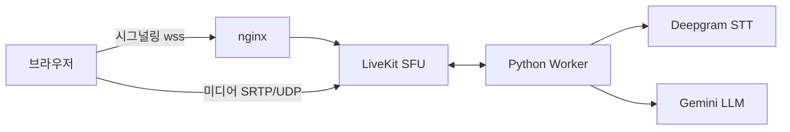
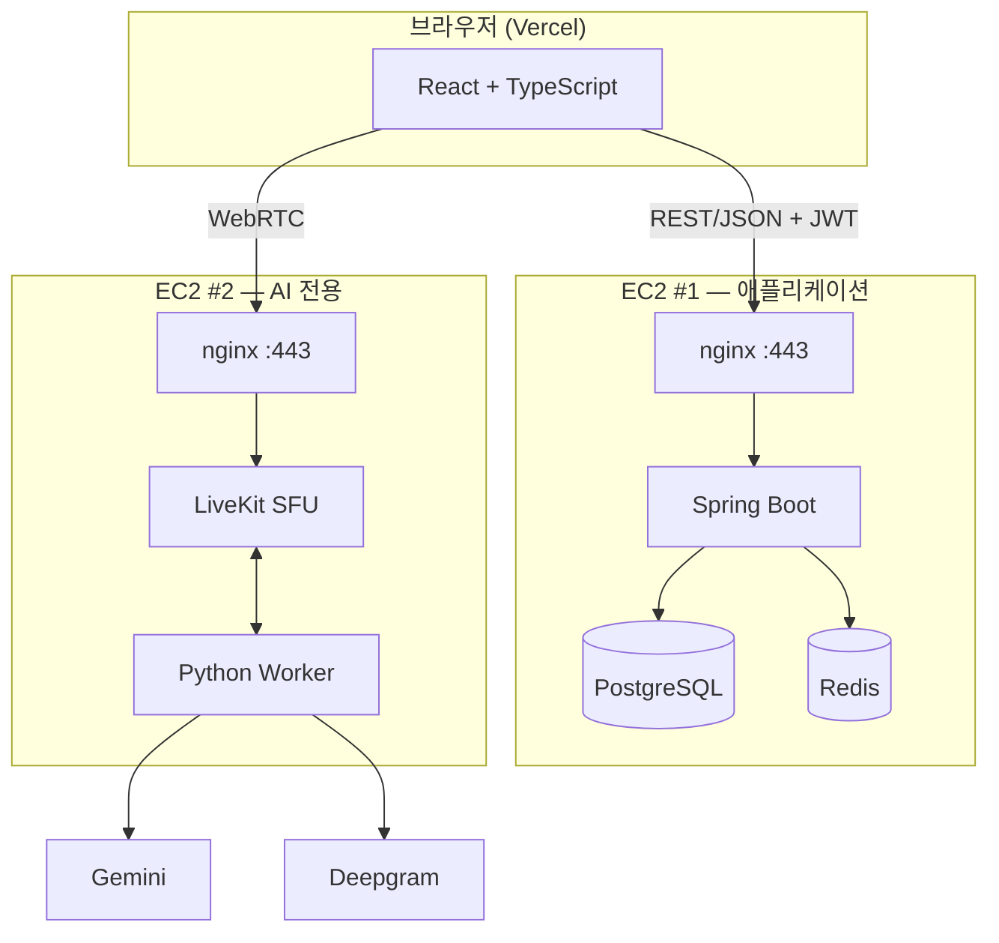
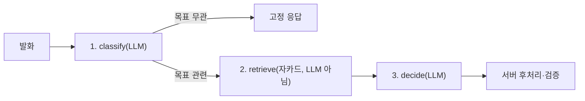

# 만다린(Mandarin) 데모데이 PPT 기획 — 이미지 위주 · 30장+

> **한 줄 정의**: "목표를 말하면, 마을이 자란다" — AI와의 대화로 만다라트를 채우고, 실천할수록 나만의 3D 마을이 성장하는 목표관리 서비스.

> **용도**: SSAFY 공통 프로젝트 최종 발표(데모데이).
> **원칙**: 슬라이드 자체는 큰 이미지 1장 + 짧은 카피(제목급 문구, 1줄) 위주로 채우고, 설명은 발표자가 말로 합니다.
> 이 문서의 "발표 멘트" 항목은 슬라이드에 그대로 옮기지 말고 **말할 내용의 재료**로만 쓰세요.
> 이미지는 전부 `[이미지: ...]`로 자리만 비워뒀습니다 — 스크린샷은 나중에 채워 넣으시면 됩니다.

---

## 사용법

1. 아래 슬라이드를 순서대로 PPT 슬라이드 1장씩에 매핑하세요. 총 **38장**입니다(요청하신 30장 이상 충족, 필요하면 4~6절에서 덜어내도 됩니다).
2. `[이미지: ...]`는 무엇을 찍거나 가져와야 하는지 설명입니다. 괄호 안에 기존 `docs/` 자료로 대체 가능한 경우 표시해뒀습니다.
3. 각 섹션 끝의 "말할 때 조심할 것"은 `docs/발표-키워드.md`의 ⚠️ 항목을 그대로 반영한 것입니다 — 데모데이 Q&A에서 그대로 씁니다.
4. 외부 통계는 전부 실제 검색으로 찾은 출처입니다. 링크를 슬라이드 하단에 아주 작게 넣거나, 발표 노트에만 남겨도 됩니다.
5. 팀이 직접 진행한 설문조사(n=118, `docs/설문조사_응답_0731.xlsx`) 결과는 8번·12번 슬라이드에 반영했습니다. 원자료 전체 통계는 **부록 E**에 정리했습니다.

---

## 목차 (섹션별 슬라이드 수)

| 섹션 | 슬라이드 | 장수 |
|---|---|---|
| 0. 오프닝 | 1~2 | 2 |
| 1. 문제 정의 (Why) | 3~8 | 6 |
| 2. 솔루션 개요 | 9~12 | 4 |
| 3. 핵심 기능 — 만다라트 | 13~16 | 4 |
| 4. 핵심 기능 — AI 코치 | 17~22 | 6 |
| 5. 핵심 기능 — 3D 마을 게임화 | 23~27 | 5 |
| 6. 부가 기능 | 28~29 | 2 |
| 7. 기술 아키텍처 | 30~34 | 5 |
| 8. 성과 · 회고 | 35~37 | 3 |
| 9. 클로징 | 38 | 1 |
| **합계** | | **38** |

---

## 디자인 시스템 — 색·타이포·구도

38장을 한 톤으로 묶기 위한 규칙입니다. **미리보기 아티팩트**에서 색상 스와치와 5개 템플릿 구도를 실제로 볼 수 있습니다.
→ **https://claude.ai/code/artifact/1936669b-2d8c-4b9d-a3fc-1414a4f02af8**

새 색을 만들지 않고 실제 서비스 UI 토큰(`frontend/src/index.css`)에서 그대로 가져왔습니다. 배경은 **완전한 흰색**입니다 — 앱도 최근 커밋(`7cd437a style: 페이지 바탕을 흰색으로 통일`)에서 같은 흰색으로 바꿨으니 그 결정을 그대로 따릅니다.

### 색상

| 역할 | 값 | 쓰는 곳 |
|---|---|---|
| 브랜드 오렌지(강조) | `#f75316` | 핵심 숫자, 화살표, 강조 한 곳에만 — 남발 금지 |
| 슬라이드 배경 | `#ffffff` | 모든 슬라이드 바탕. 완전 흰색 |
| 카드 표면 | `#ffffff` | 배경과 같은 흰색. **색을 채우지 말고 테두리(`#e6e2db`, 1px)+그림자로만** 카드를 띄웁니다 — 배경과 카드를 색으로 구분하던 예전 방식을 앱이 최근 버렸습니다 |
| sunken(빈 자리) | `#f2f0ec` | 스크린샷을 아직 못 채운 placeholder 박스, 비교 슬라이드의 "Before" 쪽 배경 |
| 본문 텍스트 | `#1a1815` | 순수 검정 대신 웜톤 잉크 |
| 보조 텍스트 | `#7c746a` | 캡션, 출처, "idle 기준" 같은 조건 표기 |
| 브랜드 소프트(웨시) | `#fff4ed` | 비교 슬라이드의 "After" 배경 등 옅은 강조 |

카드 그림자 값(PowerPoint에서 도형 효과로 재현 시): `0 1px 2px rgba(26,24,21,0.04), 0 8px 24px rgba(26,24,21,0.12)` — 흐림 반경 크게, 투명도 낮게. PPT의 "도형 서식 → 그림자 → 미리 설정 → 오프셋: 가운데, 흐리게: 20px, 투명도: 88%" 정도가 가장 근접합니다.

**카테고리 색**(3요소 아이콘, 기술스택 4그룹처럼 여러 개를 구분해야 할 때만) — 이 순서 그대로: 오렌지 `#e8590c` → 블루 `#1971c2` → 그린 `#2f9e44` → 바이올렛 `#5f3dc4` → (필요 시) 핑크 `#c2255c`. 색맹 대비 검증을 통과한 순서라 임의로 바꾸지 마세요. 5개 넘게 필요하면 색을 더 만들지 말고 표나 소그룹으로 접습니다.

### 타이포그래피

`Downloads/NanumSquareNeo`에 이미 받아두신 **나눔스퀘어네오**를 씁니다. 굵기 3개만 쓰면 충분합니다.

| 역할 | 굵기 | 크기 |
|---|---|---|
| 슬라이드 헤드카피 | ExtraBold (`dEb`) | 36~44px |
| 통계 카드 큰 숫자 | Heavy (`eHv`) | 48~56px |
| 본문·발표 캡션 | Regular (`bRg`) | 16~18px |
| eyebrow·출처 표기 | Bold (`cBd`), 자간 0.08em | 11~13px |

PowerPoint에서 **파일 → 옵션 → 저장 → "파일에 글꼴 포함"**을 체크해야 다른 PC(발표 당일 노트북 등)에서도 글꼴이 깨지지 않습니다.

### 그리드 · 안전 영역

1920×1080 기준, 12컬럼 그리드, 사방 **96px(5%) 안전 영역**. 제목은 항상 안전 영역 안쪽 상단 1/5 띠에 배치하고, 이미지는 안전 영역을 넘어 풀블리드로 나가도 되지만 그 위에 텍스트를 얹을 때는 예외 없이 안전 영역 안에만 둡니다.

### 레이아웃 템플릿 5종

| 템플릿 | 구도 | 규칙 |
|---|---|---|
| **A. 풀블리드 히어로** | 이미지가 프레임 전체, 카피 3줄 이하가 우하단에 얹힘 | 텍스트 아래는 항상 어두운 그라디언트 스크림 |
| **B. 스크린샷 카드** | 상단 20% 캡션 띠(eyebrow+헤드카피) + 하단 80% 스크린샷 카드 1장 | 카드는 흰 배경에 12px 라운드 + 테두리 + 은은한 그림자(색을 채우지 않음). 스크린샷을 아직 못 구했으면 이 자리를 sunken 회색(`#f2f0ec`) placeholder로 비워둡니다 |
| **C. 다이어그램/플로우** | 중앙에 노드-화살표 다이어그램 | 노드는 채움 없이 선(1.5px)만, 화살표만 브랜드 오렌지 |
| **D. 통계 카드 그리드** | 1~4개 카드를 그리드로 배치 | 카드는 흰 배경+테두리+그림자(B와 동일 원칙). 숫자만 브랜드 오렌지, 라벨·조건은 회색 보조텍스트로 톤 분리 |
| **E. 비교/대비** | 좌우 2분할, 가운데 얇은 구분선 | 좌측(Before)은 중립 회색, 우측(After)만 브랜드 소프트 웨시 |

### 슬라이드별 템플릿 매핑

| # | 슬라이드 | 템플릿 |
|---|---|---|
| 1 | 표지 | A |
| 2 | 팀 소개 | D (인물 카드 그리드) |
| 3 | Hook | A |
| 4 | 갓생 트렌드 | B (콜라주形) |
| 5 | 의지가 아니라 구조 | E |
| 6 | 기존 앱 한계 | D (자체 제작 UI 목업 그리드, 브랜드 미노출) |
| 7 | 우리의 인사이트 | B |
| 8 | 설문 — 문제 검증 | D |
| 9 | 만다린이란 | C |
| 10 | 핵심 3요소 | D (3분할 카드) |
| 11 | 사용자 여정 | C |
| 12 | 컨셉 반응(설문) | D |
| 13 | 만다라트란 (개념) | C |
| 14 | 만다라트 UI | B |
| 15 | 목표→도메인→과제 | B |
| 16 | 진행 관리 | B |
| 17 | AI 코치 소개 | B |
| 18 | 왜 음성 대화인가 | B |
| 19 | AI 과제 생성 과정 | B |
| 20 | 중복 방지 | B |
| 21 | 환각 방지 | B |
| 22 | 실시간 음성 아키텍처 | C |
| 23 | 왜 게임화인가 | D |
| 24 | 나만의 3D 마을 | A |
| 25 | 마을 성장 | E |
| 26 | 테마 꾸미기 | D (콜라주 그리드) |
| 27 | 친구·리더보드 | B |
| 28 | 주간 AI 리포트 | B |
| 29 | 마이페이지·보상 | B |
| 30 | 전체 시스템 구성 | C |
| 31 | 기술 스택 | D (로고 그리드) |
| 32 | AI 파이프라인 3단계 | C |
| 33 | 보안 | B |
| 34 | 신뢰할 수 없는 LLM & 테스트 | D |
| 35 | 실측 지표 | D |
| 36 | 트러블슈팅 | D (카드 3단) |
| 37 | 앞으로 할 일 | C (로드맵) |
| 38 | 마무리 | A |

---

## 0. 오프닝

### 1. 표지
- **온슬라이드 카피**: `만다린` + 한 줄 태그라인 후보 3개 중 택1
  - "목표는 세우는 것보다 계속하는 게 어렵다"
  - "혼자 세우고, 함께 키우는 목표"
  - "만다라트 × AI 코치 × 나만의 마을"
- **이미지**: [이미지: 앱 메인 화면 풀샷 또는 3D 마을 뷰 — 가장 예쁜 스크린샷 1장. 없으면 `docs/목업.png` 임시 사용]
- **발표 멘트**: 팀명(D106), SSAFY 15기 공통 프로젝트, 개발 기간(2026-07-16 ~ 08-06, 약 3주) 언급.

### 2. 팀 소개
- **온슬라이드 카피**: 팀원 이름 + 역할(FE/BE/AI/인프라 등, 본인 기준으로 채워주세요)
- **이미지**: [이미지: 팀 로고 또는 팀원 아이콘/캐릭터 6개 — 3D 마을 캐릭터 에셋 재활용 추천]
- **발표 멘트**: 6명 팀(권병수, 김재현, 이성현, 정희성, 지상근, 황우찬), 역할 분담 한 줄씩.

---

## 1. 문제 정의 (Why)

### 3. Hook — 목표는 왜 항상 실패하나
- **온슬라이드 카피**: `"새해 목표, 92%는 실패합니다"`
- **이미지**: [이미지: 텅 빈 다이어리 / 체크 안 된 투두리스트 같은 감성 이미지 — 무료 스톡 or 직접 제작]
- **발표 멘트·데이터**: 스크랜턴 대학교(University of Scranton) 및 Statistic Brain 조사 — 새해 목표를 세운 사람 중 **약 8~9%만 성공**, 나머지는 실패. ([관련 기사](https://www.dailypop.kr/news/articleView.html?idxno=96026), [분석글](https://brunch.co.kr/@habittogether/23)) 뒤(8번 슬라이드)에서 우리 팀이 직접 확인한 국내 수치도 이어서 보여줌.

### 4. 그래도 사람들은 계속 목표를 세운다 — 갓생 트렌드
- **온슬라이드 카피**: `"갓生, 그래도 우리는 계속 도전한다"`
- **이미지**: [이미지: 미라클모닝/스터디 인증 SNS 피드 느낌의 콜라주]
- **발표 멘트·데이터**: '갓생(God+人生)' — 자기계발·습관 형성에 진심인 MZ세대 트렌드. 미라클모닝 챌린지, 스터디 인증 챌린지 등이 꾸준히 확산. ([관련 기사](https://plus.hankyung.com/apps/newsinside.view?aid=202211212467d))

### 5. 문제는 "의지"가 아니라 "구조"
- **온슬라이드 카피**: `막연한 목표 → 실행 불가`
- **이미지**: [이미지: "운동하기" 같은 막연한 목표 vs 세분화된 실천과제 대비 다이어그램]
- **발표 멘트·데이터**: 목표를 세워도 무엇부터 해야 할지 모르면 실행으로 안 이어짐 — 세분화·구체화가 필요. 심리학자 Peter Gollwitzer의 "실행 의도(implementation intentions)" 연구에 따르면, 막연한 목표보다 "언제·어디서·무엇을" 구체화한 목표의 달성률이 유의미하게 높음(94개 연구 메타분석, 중간 효과크기 d=.65). ([Gollwitzer & Sheeran, 2006 메타분석](https://doi.org/10.1016/S0065-2601(06)38002-1)) 우리 자체 설문(8번 슬라이드)에서도 목표 포기 이유 중 "막막함/시작장벽"이 25%로 나와 같은 방향을 가리킴 — 8번 슬라이드에서 바로 이어서 수치로 확인시켜 줄 것.

### 6. 기존 목표관리 앱의 한계
- **온슬라이드 카피**: `투두리스트는 재미가 없다`
- **이미지**: [이미지: 특정 앱을 캡처하지 말고, 우리가 자체 제작한 "전형적인 텍스트 나열형 체크리스트" 목업 3~4개(브랜드명·로고 없이 UI 패턴만 재현) — 실제 서비스 UI를 그대로 캡처해 비교하면 특정 제품을 저격하는 것처럼 보일 수 있어 지양]
- **발표 멘트**: 텍스트 나열형 UI, 성취를 시각적으로 못 느낌, 지속 동기부여 장치 부재 — 특정 앱을 지목하지 않고 "많은 목표관리 앱이 공통적으로 가진 패턴"으로 일반화해서 말하기. 자체 설문에서도 응답자의 54%가 현재 투두앱을 아예 쓰지 않는다고 답했다는 수치(부록 E)를 곁들이면 근거가 보강됨.

### 7. 우리의 인사이트
- **온슬라이드 카피**: `세분화(만다라트) + 대화형 코칭(AI) + 눈에 보이는 성장(게임화)`
- **이미지**: [이미지: 오타니 쇼헤이 만다라트 계획표 원본 이미지 — 저작권 확인 후 사용 또는 재현 이미지]
- **발표 멘트·데이터**: 오타니 쇼헤이가 고교 1학년 때 작성한 9x9 만다라트 계획표가 실제 목표 달성으로 이어진 유명 사례. 가운데 핵심 목표 → 8개 세부 목표 → 각 8개 실천과제로 확장. ([기사1](https://insightpress.kr/mandalart-chart-goal-setting-ohtani-method/), [기사2](https://heraldk.com/2024/12/31/%E2%80%9C2025%EB%85%84-%EA%B3%84%ED%9A%8D-%EC%84%B8%EC%9A%B0%EA%B8%B0-%EC%A0%84-%EA%BC%AD-%EB%B3%B4%EB%9D%BC%E2%80%9D%E2%80%A6%EC%98%A4%ED%83%80%EB%8B%88-%EA%B3%84%ED%9A%8D%ED%91%9C-%EB%8C%80%EC%B2%B4/))

### 8. 우리가 직접 확인했습니다 — 자체 설문 118명
- **온슬라이드 카피**: `설문 118명 · 목표 완수율 50% 미만 56%`
- **이미지**: [이미지: 막대그래프 2개 — ① 최근 1년 목표 완수 비율 분포(0~25% 15% / 25~50% 41% / 50~75% 31% / 75%이상 13%) ② 목표 포기 이유 Top3(목표를 잊어버림 47%, 시간 부족 42%, 성취감 부족 30%). 데이터는 부록 E 참고]
- **발표 멘트·데이터**: 팀이 직접 진행한 자체 설문(n=118, 2026-07-31 마감, `docs/설문조사_응답_0731.xlsx`). 최근 1년간 세운 목표를 **절반도 못 지켰다는 응답이 56%**(0~25% 15% + 25~50% 41%). 포기 이유 1위는 "목표를 잊어버림"(47%), 2위 "시간 부족"(42%), 3위 "성취감 부족"(30%) — 이 세 가지가 각각 AI 코치의 리마인드, 짧은 실천 단위(만다라트 세분화), 시각적 성장(게임화)으로 대응된다는 것을 여기서 한 번 짚고 넘어가면 좋음.
- **추가 인사이트(발표자용, 시간 되면 언급)**: 만다라트를 "처음 들어봤다"는 응답이 51%로 절반 이상 — 인지도 자체가 낮음. 흥미로운 지점은, **실제로 만다라트를 써본 응답자(23명)가 매긴 "81칸 채우기 부담" 평균은 5점 만점에 2.35점**으로 낮은 반면, 안 써본 사람 중 23%는 "81칸이 부담스러워서" 안 써봤다고 답함 — **경험보다 선입견이 진입장벽을 더 키운다**는 뜻이고, AI가 대화만으로 채워주는 설계가 이 선입견을 없애는 근거가 됨.

**말할 때 조심할 것**: 8% 통계는 미국 조사(Statistic Brain / Univ. of Scranton) 기반이고, 118명 설문은 SSAFY 교육생 위주 표본(무작위 아님, 자기선택편향 가능)입니다. "전국 조사 결과"나 "국내 통계로는"이라고 뭉뚱그리지 말고 각각 출처를 정확히 말할 것.

---

## 2. 솔루션 개요

### 9. 만다린이란
- **온슬라이드 카피**: `만다라트로 세우고, AI와 대화하며 채우고, 마을로 키운다`
- **이미지**: [이미지: 서비스 3요소를 아이콘 3개로 배치한 심플 다이어그램]
- **발표 멘트**: 한 문장 엘리베이터 피치.

### 10. 핵심 3요소
- **온슬라이드 카피**: `만다라트 시트 · AI 코치 · 3D 마을`
- **이미지**: [이미지: 3분할 레이아웃 — 만다라트 그리드 스크린샷 / AI 코치 채팅 스크린샷 / 3D 마을 스크린샷]
- **발표 멘트**: 각 요소를 한 줄씩 티저로 언급하고 이후 섹션에서 상세 설명 예고.

### 11. 사용자 여정 한눈에
- **온슬라이드 카피**: `가입 → 목표 설계 → AI 대화 → 실천 → 마을 성장 → 리포트`
- **이미지**: [이미지: `docs/플로우차트.png` 재활용 또는 재디자인한 여정 다이어그램]
- **발표 멘트**: 전체 사용 흐름을 15초 안에 훑기.

### 12. 컨셉 반응은 뜨거웠다
- **온슬라이드 카피**: `매력도 4.21 · 동기부여 도움 4.19 · 사용 의향 95%`
- **이미지**: 막대 4개(5점 척도 평균) + 원형 미터 1개(사용 의향 95%) 조합 차트. **완성된 목업을 아래 아티팩트로 만들어뒀습니다 — 색상 hex 값까지 그대로 캡처해서 쓰시면 됩니다.**
  → **https://claude.ai/code/artifact/8d09dde5-bf56-46b2-b2de-bea051f9c91e**

  **레이아웃** (16:9, 좌 58% : 우 42% 2단 분할)
  - 좌측: 가로 막대 4개, 내림차순(매력도 4.21 → 동기부여 4.19 → 그룹의향 4.16 → AI신뢰도 3.66). 막대 두께 24px, 끝은 4px 라운드. 척도 3점(보통) 위치에 점선 기준선 — "전부 보통 이상"이라는 걸 한눈에 보여줌. 값 라벨은 막대 끝에 직접 표기(4.21 등), 항목명은 막대 위에 왼쪽 정렬로 작게.
  - 우측: 원형 도넛 미터, 안에 큰 숫자 **95%** + 아래 작은 글씨로 "112 / 118명", 미터 아래 라벨 "서비스 출시 시 사용 의향". 세로 구분선(연한 회색 1px)으로 좌/우 분리.
  - 하단: 얇은 회색 선 + "자체 설문조사 · SSAFY 교육생 대상 · n=118 · 2026-07-31 마감" 출처 캡션(11~12px, muted).
  - 상단: 작은 eyebrow "자체 설문조사 · n=118" + 슬라이드 제목.

  **색상** (다크모드 대응 값도 있으니 발표 환경에 맞는 쪽 사용)
  | 요소 | 라이트 | 다크 |
  |---|---|---|
  | 막대 4개(전부 동일 색 — 값 차이는 길이로만 표현, 색으로 순위를 매기지 않음) | `#2a78d6` (블루) | `#3987e5` |
  | 미터 채움(오렌지 — 막대와 다른 지표 축이라 다음 계열색 사용) | `#eb6834` | `#d95926` |
  | 미터 트랙(안 채워진 부분) | `#eb6834` 14% 투명도 | `#d95926` 18% 투명도 |
  | 배경(슬라이드 카드) | `#fcfcfb` | `#1a1a19` |
  | 본문 텍스트 | `#0b0b0b` | `#ffffff` |
  | 보조 텍스트(항목명) | `#52514e` | `#c3c2b7` |
  | 축/캡션(가장 흐림) | `#898781` | `#898781` |
  | 기준선(점선)·구분선 | `#c3c2b7` / `#e1e0d9` | `#383835` / `#2c2c2a` |

  막대 4개를 굳이 무지개색으로 안 칠한 이유: 4개 다 "같은 5점 척도로 물어본 질문"이라 하나의 시리즈로 보는 게 맞고, 낮은 값(AI신뢰도)에 다른 색을 쓰면 "얘만 나쁘다"는 인상을 과장하게 됩니다. 길이 차이만으로 충분히 전달돼서 색은 통일했습니다.
- **발표 멘트·데이터**: 같은 설문(n=118)에서 지금 방금 소개한 컨셉을 그대로 물어봤습니다. "체크리스트 대신 목표 달성 과정이 도시처럼 자라난다"는 컨셉 매력도 평균 **4.21/5**(4~5점 응답 88%), "지속 동기부여에 도움될 것 같다" 평균 **4.19/5**. "최대 4인이 함께하는 그룹 세션" 의향도 평균 **4.16/5**로 높게 나와 그룹 기능을 다음 단계 최우선 과제로 잡은 근거가 됨(37번 슬라이드와 연결). "AI가 대화로 계획을 자동으로 짜준다"에 대한 신뢰도는 평균 **3.66/5**으로 다른 항목보다 낮은데, 이 격차가 21번 슬라이드(구조화 출력 + 서버 검증)를 설계한 이유. 서비스가 나오면 **95%가 "사용해보고 싶다"**고 응답.

---

## 3. 핵심 기능 — 만다라트

### 13. 만다라트란 (개념)
- **온슬라이드 카피**: `9x9, 목표를 실행 가능한 단위로`
- **이미지**: [이미지: 빈 만다라트 그리드 다이어그램(9칸x9칸 구조 설명용)]
- **발표 멘트**: 중심 목표 1개 → 세부 목표 8개(도메인) → 각 도메인당 실천과제 8개 = 최대 64개 실천과제.

### 14. 우리 앱의 만다라트 UI
- **온슬라이드 카피**: (거의 텍스트 없이 이미지만)
- **이미지**: [스크린샷 필요: `MandalartGrid` 컴포넌트 실제 화면 — 목표 입력~그리드 채우기 화면]
- **발표 멘트**: `DomainCell` 컴포넌트를 재사용해 9칸을 렌더링한다는 기술적 포인트는 다음 섹션(기술)에서.

### 15. 목표 → 도메인 → 과제 구조
- **온슬라이드 카피**: `목표 1개 · 도메인 8개 · 과제 최대 8개씩`
- **이미지**: [스크린샷 필요: 목표 상세 페이지(SheetDetail) — 도메인별 과제 리스트 펼친 화면]
- **발표 멘트**: 반복 주기(매일/매주/없음, `Period` 타입) 설정 가능.

### 16. 진행 관리
- **온슬라이드 카피**: `체크 한 번으로 기록`
- **이미지**: [스크린샷 필요: 과제 체크/실천 기록 UI, 진행률 바(ProgressBar)]
- **발표 멘트**: 실천 기록이 리포트·마을 성장의 데이터 소스가 됨(다음 섹션들과 연결되는 포인트).

---

## 4. 핵심 기능 — AI 코치

### 17. AI 코치 소개
- **온슬라이드 카피**: `말로도, 글로도 — 목표를 함께 설계하는 AI`
- **이미지**: [스크린샷 필요: AiCoachPage 전체 화면 — 좌측 시트 패널 + 우측 대화창]
- **발표 멘트**: 텍스트+음성 입력, 응답은 텍스트만(TTS 의도적 미도입 — 이유는 다음 슬라이드).

### 18. 왜 음성 대화인가
- **온슬라이드 카피**: `타이핑보다 자연스럽게`
- **이미지**: [이미지: 마이크 버튼 클릭 → 실시간 캡션 뜨는 장면 스크린샷]
- **발표 멘트**: WebRTC 기반 실시간 STT(Deepgram). 캡션은 interim(임시)/final(확정) 두 종류.

### 19. AI가 과제를 만들어주는 과정
- **온슬라이드 카피**: `대화 한 번 → 과제 후보 제안 → 담기`
- **이미지**: [스크린샷 필요: 대화 중 AI가 과제를 제안하고 "담기" 버튼이 뜨는 순간]
- **발표 멘트**: `mandarin.goal` payload로 구조화된 결과가 옴. 실제 발화당 응답 시간 **2.25~2.83초** (단일 사용자, 표본 3회 — 조건 꼭 같이 언급).

### 20. 중복 과제는 만들지 않는다
- **온슬라이드 카피**: `이미 있는 과제는 다시 만들지 않습니다`
- **이미지**: [이미지: "이미 담아둔 과제예요" 안내 문구가 뜨는 UI 캡처]
- **발표 멘트**: 바이그램 자카드 유사도(`|A∩B| / |A∪B|`)로 후보 검색 → LLM이 최종 판단. 벡터 DB 없이 해결한 설계 포인트(`ai_livekit/HANDOFF.md` 3절 근거).

### 21. AI는 없는 걸 지어내지 않는다
- **온슬라이드 카피**: `모르면 되묻는다, 지어내지 않는다`
- **이미지**: [이미지: 명확화 질문(clarify_question)이 오는 대화 스크린샷]
- **발표 멘트**: 구조화 출력(`responseSchema`)으로 형식 강제 + **확인 가능한 사실은 서버가 최종 판정**(새 도메인 여부, 기존 과제 제목). 프롬프트 인젝션 방어(태그 이스케이프)도 언급. 자체 설문(12번 슬라이드)에서 "AI가 계획을 자동으로 짜준다"에 대한 신뢰도가 3.66/5으로 다른 항목보다 낮게 나왔던 것과 바로 연결되는 슬라이드 — "그래서 이렇게 안전장치를 뒀다"는 흐름으로 말하면 설득력이 커짐.

### 22. 실시간 음성 아키텍처
- **온슬라이드 카피**: (다이어그램만, 텍스트 최소화)
- **이미지**: [이미지: WebRTC/SFU 구조도 — 아래 mermaid를 이미지로 변환해서 사용]

- **발표 멘트·데이터**: 왜 SFU인가 — Mesh는 N-1 업링크 폭발, MCU는 서버 CPU 과다, SFU는 라우팅만 해서 가볍다. 미디어는 nginx가 프록시 못하므로 시그널링만 프록시하고 미디어는 브라우저가 LiveKit에 직접 연결.

**말할 때 조심할 것**:
- "동시 사용자 몇 명까지?" → **"측정하지 않았습니다"**가 정답. LLM 게이트웨이 rate limit이 가장 낮은 병목으로 추정.
- SFU 부하("CPU 0.08%") → **idle 상태 값**임을 반드시 명시. 부하 시 거동은 미측정.
- 응답 시간 2.25~2.83초 → 단일 사용자·표본 3회 조건 반드시 병기.

---

## 5. 핵심 기능 — 3D 마을 게임화

### 23. 왜 게임화인가
- **온슬라이드 카피**: `보상은 눈에 보여야 한다`
- **이미지**: [이미지: 게임화 6요소(도전/레벨/공유/경쟁/성취/보상) 아이콘 다이어그램]
- **발표 멘트·데이터**: 게이미피케이션(도전·보상·접근 전략)은 사용자 몰입과 지속사용의도에 긍정적 영향(피트니스 앱 연구). Duolingo·Fitbit·Toss 등이 레벨업/챌린지/보상 아이콘으로 지속 사용을 유도한 선례. ([관련 기사](https://www.harpersbazaar.co.kr/article/74020), [KB 리포트](https://kbthink.com/main/economy/economic-in-depth-analysis/economic-research-report/series2-230512.html)) 자체 설문에서도 시각화 매력도 4.21/5로 확인됨(12번 슬라이드).

### 24. 나만의 3D 마을
- **온슬라이드 카피**: (이미지 풀샷, 카피 없음)
- **이미지**: [스크린샷 필요: VillagePage 아이소메트릭 3D 뷰 — 가장 화려하게 꾸며진 상태로]
- **발표 멘트**: Three.js + react-three-fiber로 구현한 아이소메트릭 씬. 카메라 컨트롤로 회전/줌 가능.

### 25. 목표 달성 → 마을 성장
- **온슬라이드 카피**: `과제를 완료할수록 마을이 자란다`
- **이미지**: [스크린샷 필요: 건물이 성장하는 전/후 비교(Before/After) 2컷]
- **발표 멘트**: `GrowableObject` — 실천 기록이 랜드마크·건물 성장으로 시각화됨.

### 26. 나만의 테마로 꾸미기
- **온슬라이드 카피**: `사이버펑크부터 사쿠라, 이집트까지`
- **이미지**: [스크린샷 필요: 상점(ShopPage) 화면 + 프리미엄 테마 3~4개 썸네일 콜라주 — cyber/sakura/egypt/nordic/santorini/seoul 등]
- **발표 멘트**: 보상으로 얻은 재화로 건물·테마 구매. 커스터마이징이 재방문 동기가 됨.

### 27. 친구와 함께, 순위로 동기부여
- **온슬라이드 카피**: `혼자보다 함께`
- **이미지**: [스크린샷 필요: LeaderboardPage + FriendsPage 화면]
- **발표 멘트**: 친구 추가, 리더보드로 경쟁 요소 추가. "혼자 하는 목표관리"의 외로움을 보완하는 축.

---

## 6. 부가 기능

### 28. 주간 AI 리포트
- **온슬라이드 카피**: `일주일을 AI가 요약해준다`
- **이미지**: [스크린샷 필요: ReportPage 주간 리포트 화면]
- **발표 멘트**: LLM이 실천 기록을 요약·분석. 생성이 느려서 **Redis에 캐시**해 두 번째 요청부터 즉시 응답.

### 29. 마이페이지 · 보상
- **온슬라이드 카피**: `내 성장을 한눈에`
- **이미지**: [스크린샷 필요: MyPage 통계 카드 + 보상 모달(RewardClaimModal)]
- **발표 멘트**: 누적 통계, 마일스톤 보상 팝오버로 성취 피드백 제공.

---

## 7. 기술 아키텍처

### 30. 전체 시스템 구성
- **온슬라이드 카피**: (다이어그램 위주)
- **이미지**: [이미지: 아래 mermaid를 변환한 배포 구조도]

- **발표 멘트**: 왜 AI 서버를 분리했는가 — ① 트래픽 특성이 다름(짧은 요청-응답 vs 지속적 UDP 스트림) ② 미디어는 리버스 프록시를 통과할 수 없음(SRTP/UDP).

### 31. 기술 스택 한눈에
- **온슬라이드 카피**: 로고 아이콘 나열 (React, TypeScript, Vite, Tailwind, Three.js / Spring Boot, PostgreSQL, Redis, JWT+OAuth2 / LiveKit, Deepgram, Gemini / Docker, nginx, Jenkins)
- **이미지**: [이미지: 기술 로고 아이콘 그리드 — devicon 등에서 수집]
- **발표 멘트**: 프론트/백/AI/인프라 4개 그룹으로 나눠서 훑기.

### 32. AI 파이프라인 3단계
- **온슬라이드 카피**: `분류 → 검색 → 판단`
- **이미지**: [이미지: 아래 mermaid 변환]

- **발표 멘트·데이터**: 왜 2번 호출하나 — 중복 검사에 후보 목록이 필요하고, 검색하려면 도메인을 먼저 알아야 함(데이터 의존성). 목표 무관 발화는 1단계에서 끊겨 **호출 절반으로 절감**. classify 평균 1.34초 / decide 평균 1.13초(단일 사용자·표본 3회).

### 33. 보안
- **온슬라이드 카피**: `카카오 로그인 · JWT · 서명 알고리즘 고정`
- **이미지**: [이미지: OAuth 로그인 화면 스크린샷 + JWT 구조 다이어그램(header.payload.signature)]
- **발표 멘트**: OAuth2(카카오) + 자체 JWT(access/refresh), refresh rotation + 재사용 탐지, HS256 고정(비대칭 강한 키로 자동 승격 방지). **JWT는 암호화가 아니라 서명** — payload는 누구나 읽을 수 있다는 점은 정확히 답변.

### 34. 신뢰할 수 없는 LLM 다루기 & 테스트
- **온슬라이드 카피**: `AI는 제안기, 판정은 서버가 한다`
- **이미지**: [이미지: "권한 분리" 표(사용자 의도=LLM, 새 도메인 여부=서버) 심플 인포그래픽]
- **발표 멘트**: 구조화 출력, 프롬프트 인젝션 이스케이프, 필드 순서 고정(잘려도 되는 `reasoning`을 맨 뒤로). 테스트 107개 — 그중 아키텍처 테스트(`import` 차단으로 계층 분리 강제)가 특이점.

**말할 때 조심할 것**: "배포 다 됐나?" → 앱 서버는 배포 진행 중, **AI EC2는 산출물(Dockerfile/compose/livekit.yaml)만 준비**되고 실제 배포·TLS는 남은 상태. 사실대로 답할 것.

---

## 8. 성과 · 회고

### 35. 실측 지표 (조건 명시 필수)
- **온슬라이드 카피**: 숫자 위주 카드 4~5개
- **이미지**: [이미지: 통계 카드 레이아웃 — 아래 표를 카드형으로 디자인]

| 지표 | 값 | 조건 |
|---|---|---|
| 테스트 | 107개 통과 | `pytest tests -q` |
| 발화당 응답 | 2.25~2.83초 | 단일 사용자, 표본 3회 |
| worker idle 메모리 | 757MB | 활성 job 0개 |
| LiveKit idle | 32MB / CPU 0.08% | 방 0개, 오디오 미흐름 |

- **발표 멘트**: 모든 수치 옆에 조건을 같이 말한다 — "idle 기준", "표본 3회" 같은 표현을 습관적으로 붙이기.

### 36. 트러블슈팅 — 조용히 실패하던 버그들
- **온슬라이드 카피**: `에러 없이 기능이 죽는 버그가 제일 위험했다`
- **이미지**: [이미지: 버그→원인→해결 3단 카드 1~2개 선정. 후보: (1) Spring이 `period`로 보내는데 AI가 `frequency`만 받아 빈도 표시·검색 가점이 동시에 죽은 사례 (2) 마이크 mute해도 무음 프레임이 계속 흘러 STT 요금이 새던 사례]
- **발표 멘트**: 예외가 안 나는 실패가 가장 위험하다는 팀의 원칙(`docs/기술스택.md` 9절) 소개. "조용한 실패를 없애기"를 팀 원칙으로 제시하면 인상적.

### 37. 앞으로 할 일
- **온슬라이드 카피**: `그룹 기능 완성 · 부하 테스트 · 다중 노드 · TTS 확장`
- **이미지**: [이미지: 로드맵 타임라인 아이콘형]
- **발표 멘트**: **그룹 만다라트 백엔드 연동**(화면·데이터 모델은 구현 완료, 서버 API 연동이 남음 — 설문에서 그룹 기능 사용 의향이 평균 4.16/5로 높게 나와 우선순위로 반영, 12번 슬라이드), 동시 사용자 부하 테스트, EC2 실배포·TLS 적용, 다중 노드 SFU, LLM 응답 품질 자동 평가(eval).

---

## 9. 클로징

### 38. 마무리
- **온슬라이드 카피**: `만다린 — 목표는 함께, 성장은 눈에 보이게`
- **이미지**: [이미지: 팀 사진 또는 마을 풀샷 재사용 + "Q&A" 텍스트]
- **발표 멘트**: 감사 인사, Q&A 유도.

---

## 부록 A. 스크린샷 촬영 체크리스트 (이미지 채울 때 참고)

`[스크린샷 필요]`로 표시된 슬라이드용으로 나중에 앱을 로컬/배포본에서 캡처할 때 순서대로 도세요.

- [ ] 랜딩 페이지 (LandingPage)
- [ ] 만다라트 그리드 — 빈 상태 / 채운 상태 2컷 (MandalartGrid, SheetDetail)
- [ ] AI 코치 대화 화면 — 텍스트 대화 + 마이크 켠 상태 2컷 (AiCoachPage)
- [ ] AI가 과제 제안하는 순간 (담기 버튼 노출 상태)
- [ ] "이미 담아둔 과제예요" 안내
- [ ] 3D 마을 뷰 — 꾸며진 상태 (VillagePage)
- [ ] 건물 성장 전/후 비교
- [ ] 상점 화면 (ShopPage) + 프리미엄 테마 여러 개
- [ ] 리더보드 (LeaderboardPage)
- [ ] 친구 목록 (FriendsPage)
- [ ] 주간 리포트 (ReportPage)
- [ ] 마이페이지 통계 카드 (MyPage)
- [ ] 보상 모달 (RewardClaimModal)

## 부록 B. 기존 `docs/` 자료 재사용 후보

새로 만들 필요 없이 바로 가져다 쓸 수 있는 파일입니다.

| 파일 | 활용 슬라이드 |
|---|---|
| `docs/erd.png` | (필요 시) 기술 아키텍처 섹션에 DB 구조 보충 슬라이드 추가 |
| `docs/플로우차트.png` | 11번 "사용자 여정" |
| `docs/목업.png` | 표지 임시 이미지, 초기 기획 회고용 |
| `docs/와이어프레임.pdf` | 기획→실제 화면 비교(Before/After) 슬라이드를 추가하고 싶다면 |
| `docs/화면설계서_0724.pptx` | 위와 동일 |
| `docs/만다린_중간발표.pptx` | 중간발표 대비 달라진 점 비교 슬라이드를 넣고 싶다면 |
| `docs/설문조사_응답_0731.xlsx` | 8번·12번 슬라이드 차트 제작용 원자료 (부록 E 참고) |

## 부록 C. 인용 외부 자료 모음 (출처 링크)

| 슬라이드 | 통계/사실 | 출처 |
|---|---|---|
| 3 | 새해 목표 성공률 약 8~9% | [기사](https://www.dailypop.kr/news/articleView.html?idxno=96026), [분석](https://brunch.co.kr/@habittogether/23) — 원출처: Statistic Brain, Univ. of Scranton (Journal of Clinical Psychology) |
| 4 | 갓생 트렌드 | [한경 매거진](https://plus.hankyung.com/apps/newsinside.view?aid=202211212467d) |
| 5 | 실행 의도(implementation intentions) 목표 달성률 | [Gollwitzer & Sheeran, 2006 메타분석](https://doi.org/10.1016/S0065-2601(06)38002-1) |
| 7 | 오타니 쇼헤이 만다라트 사례 | [InsightPress](https://insightpress.kr/mandalart-chart-goal-setting-ohtani-method/), [헤럴드경제](https://heraldk.com/2024/12/31/%E2%80%9C2025%EB%85%84-%EA%B3%84%ED%9A%8D-%EC%84%B8%EC%9A%B0%EA%B8%B0-%EC%A0%84-%EA%BC%AD-%EB%B3%B4%EB%9D%BC%E2%80%9D%E2%80%A6%EC%98%A4%ED%83%80%EB%8B%88-%EA%B3%84%ED%9A%8D%ED%91%9C-%EB%8C%80%EC%B2%B4/) |
| 23 | 게이미피케이션 효과(피트니스 앱 몰입/지속사용) | [DBpia 논문](https://www.dbpia.co.kr/journal/articleDetail?nodeId=NODE08008808), [하퍼스 바자](https://www.harpersbazaar.co.kr/article/74020), [KB 리포트](https://kbthink.com/main/economy/economic-in-depth-analysis/economic-research-report/series2-230512.html) |

> 새해 목표 8% 통계와 갓생 트렌드는 국내 매체가 재인용한 것이라 1차 출처(SBRI 원문)는 못 찾았습니다. 발표에서는 "Statistic Brain 및 스크랜턴대 연구에 따르면"으로 언급하고, 정확한 수치를 추궁받으면 "국내 재인용 기사 기준"이라고 덧붙이세요.

## 부록 D. 예상 질문 대비 (요약)

전체 목록은 `docs/발표-키워드.md`에 있습니다. 데모데이에서 가장 자주 나올 법한 것만 추립니다.

| 질문 | 짧은 답 |
|---|---|
| 왜 WebRTC/SFU인가? | HTTP는 요청-응답이라 지속 스트림에 부적합. SFU가 Mesh/MCU 대비 균형점 |
| AI 헛소리는 어떻게 막나? | 구조화 출력 + 확인 가능한 값은 서버가 판정 + 없는 정보면 되묻기 |
| 동시 사용자 몇 명까지? | **측정 안 함.** LLM 게이트웨이 rate limit이 가장 낮은 병목으로 추정 |
| 배포 다 됐나? | 앱 서버는 진행 중, AI 서버는 산출물만 준비되고 실배포는 남음 |
| JWT 안전한가? | 서명(위조 방지)이지 암호화(열람 방지)가 아님 |
| 설문조사는 어떻게 진행했나? | SSAFY 교육생 대상 구글폼, n=118, 2026-07-31 마감. 무작위 표본 아님 |

## 부록 E. 자체 설문조사 원자료 요약 (n=118)

원본 파일: `docs/설문조사_응답_0731.xlsx` (응답 118건, 2026-07-31 기준). 8번·12번 슬라이드의 차트를 만들 때 이 표를 그대로 쓰면 됩니다.

**문제 정의 관련 (8번 슬라이드)**

| 항목 | 결과 |
|---|---|
| 현재 투두앱 미사용 | 54% (64/118) |
| 사용 중인 투두앱 (복수응답) | 캘린더 67%, 다이어리/노트 39%, 습관 트래커 20%, 만다라트 4% |
| 최근 1년 목표 완수 비율 | 0~25%: 15% · 25~50%: 41% · 50~75%: 31% · 75%이상: 13% (**50% 미만 합산 56%**) |
| 목표 포기 이유 Top3 (복수응답) | 목표를 잊어버림 47% · 시간 부족 42% · 성취감 부족 30% (4위 막막함/시작장벽 25%) |
| 만다라트 인지도 | 처음 들어봄 51% · 알지만 안 써봄 30% · 실제 사용 19% |
| 81칸 채우기 부담 (실사용자 23명만, 5점 척도) | 평균 **2.35 / 5** (낮음) |
| 안 써본 이유 | 사용해본적 있거나 관심없음 48% · 어떻게 채워야 할지 모름 29% · 81칸이 부담스러움 23% |

**컨셉 검증 관련 (12번 슬라이드, 전부 5점 척도 또는 예/아니오)**

| 항목 | 평균/비율 | 4~5점 비율 |
|---|---|---|
| 도시/마을 성장 시각화 매력도 | 4.21 | 88% |
| 시각화가 지속 동기부여에 도움될 것 같음 | 4.19 | 84% |
| 최대 4인 그룹 세션 기능 사용 의향 | 4.16 | 80% |
| AI 대화 기반 자동 계획 생성 신뢰도 | 3.66 | 60% |
| 서비스 출시 시 사용 의향 (예) | **95%** (112/118) | — |

**자유의견 (64/118명 작성, 원자료 참고)** — 실제 반영/향후 계획과 맞닿아 있는 요청이 많았습니다.

- 테마를 다양하게 선택하고 싶다 → **이미 반영됨**(26번 슬라이드, 프리미엄 테마 다수)
- 랭킹/경쟁 기능 → **이미 반영됨**(27번 슬라이드, 리더보드)
- 진행률 자동 계산 → **이미 반영됨**(16번 슬라이드, ProgressBar)
- "4인 제한이 아쉽다", "더 많은 인원이 함께하고 싶다" → 그룹 기능 확장 시 참고
- "AI가 원하는 방향과 다르게 짜줄까 걱정", "질문마다 답이 달라져 신뢰가 애매" → AI 신뢰도 항목(3.66)과 같은 맥락, 21번 슬라이드에서 다루는 안전장치로 대응
- 위젯 연동, SNS 공유, 진행 과정을 계절/시간에 따라 다르게 표현 등 → 향후 로드맵 후보로 메모해두면 좋음
