# 시연 시나리오

## 랜딩 페이지
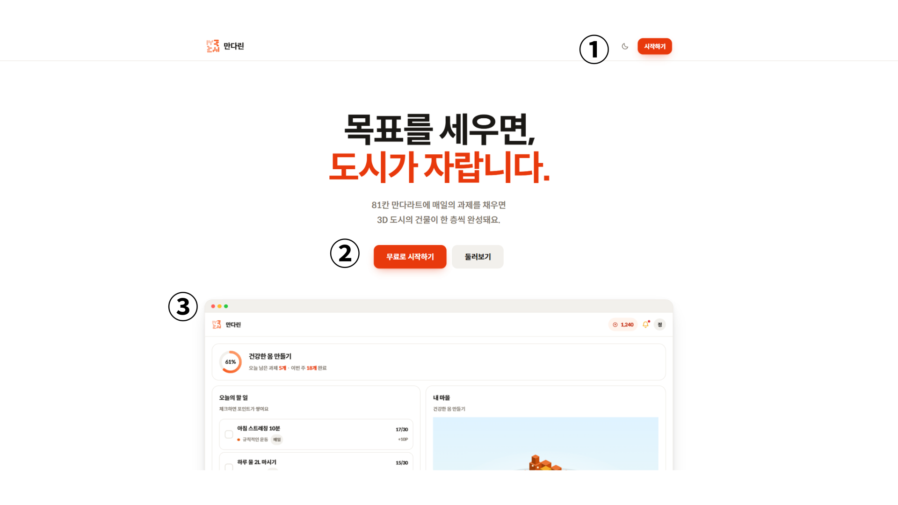
1.  시작하기
    - 시작하기 버튼을 통해 로그인 페이지로 이동할 수 있습니다.
2.  시작하기 및 둘러보기
    - 로그인 페이지로 이동할 수 있으며 로그인 시 홈화면으로 이동할 수 있습니다
3. 만다린 소개
    - 만다린 프로젝트에 대한 설명들을 볼 수 있습니다.

## 로그인 페이지
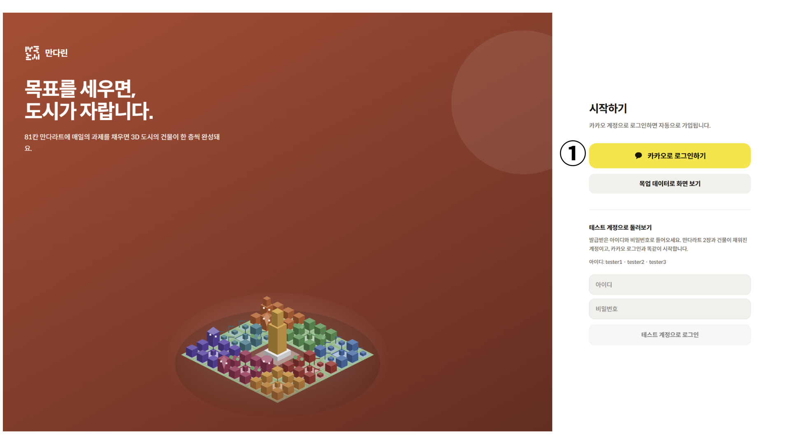
1. 카카오로 시작하기
    - 카카오 계정으로 로그인하여 서비스를 이용할 수 있습니다.

## 홈 화면
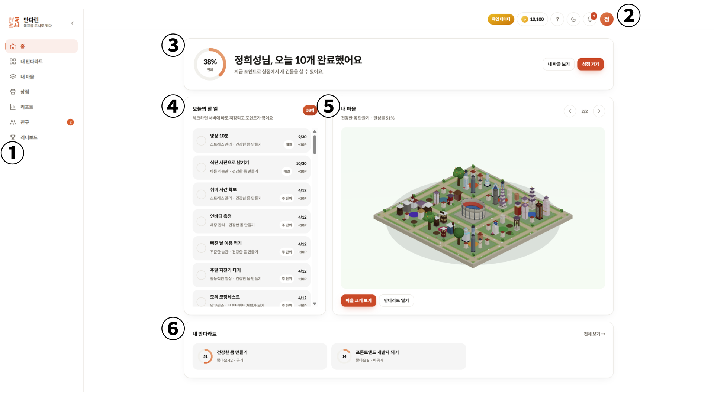
1. 사이드 네비게이션
    - 홈, 내 만다라트, 내 마을, 상점, 리포트, 친구, 리더보드 등 주요 서비스 페이지로 빠르게 이동할 수 있습니다.
2. 상단 상태바 및 프로필
    - 보유 포인트 현황, 만다라트 튜토리얼, 다크모드 설정, 알림 목록 및 사용자 프로필 정보를 확인할 수 있습니다.
3. 목표 달성 요약 배너
    - 전체 만다라트 달성률과 오늘 완수한 과제 수를 확인하고, 내 마을 보기 및 상점으로 바로 이동할 수 있습니다.
4. 오늘의 할 일
    - 당일 수행해야 할 세부 과제 목록을 확인하고, 과제 완료 체크를 통해 포인트를 적립할 수 있습니다.
5. 3D 마을 미리보기
    - 현재 선택한 만다라트 시트의 3D 마을 지형과 건물 배치를 확인하고, 마을 크게 보기 및 만다라트 상세 조회가 가능합니다.
6. 내 만다라트 목록
    - 작성한 만다라트 시트들의 진행률, 좋아요 수 및 공개 여부를 확인하고 개별 시트로 이동할 수 있습니다.

## 내 만다라트
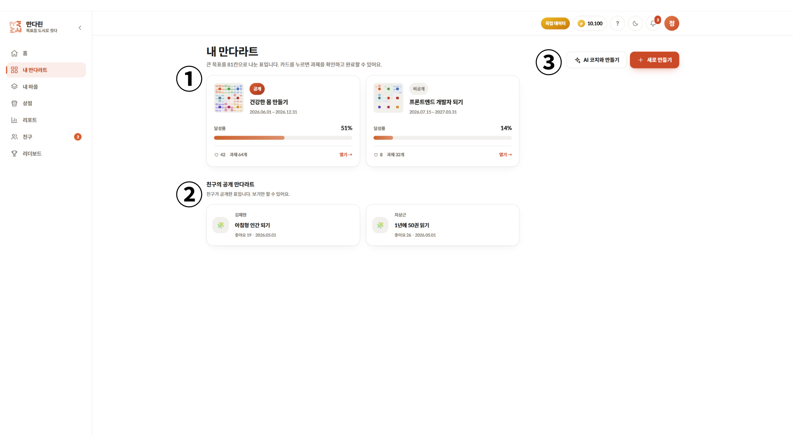
1. 내 만다라트 목록
    - 본인이 작성한 만다라트 시트들의 목표 기간, 진행률, 공개 여부 및 과제 수 등을 확인하고 상세 페이지로 이동할 수 있습니다.
2. 친구의 공개 만다라트
    - 친구들이 공개 설정한 만다라트 시트 목록을 확인하고 선택하여 친구의 목표를 둘러볼 수 있습니다.
3. 만다라트 생성 버튼
    - 'AI 코치와 만들기'를 통해 음성 대화 기반으로 만다라트를 생성하거나, '새로 만들기'를 통해 직접 새로운 만다라트를 작성할 수 있습니다.

## 만다라트 생성
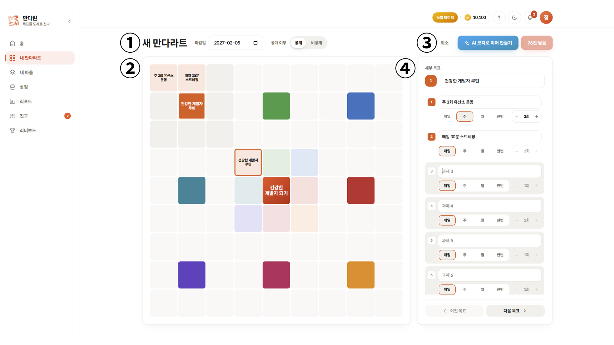
1. 마감일 및 공개 여부 설정
    - 만다라트 시트의 최종 마감일을 선택하고 시트의 공개/비공개 여부를 설정할 수 있습니다.
2. 9x9 만다라트 그리드
    - 중앙의 핵심 목표, 8개 세부 목표 및 64개 세부 과제가 실시간 반영되는 81칸의 만다라트 전체 구조를 시각적으로 확인할 수 있습니다.
3. 생성 옵션 버튼 및 작성 현황
    - 작성 취소 기능과 함께 전체 81칸 중 작성이 필요한 잔여 칸 수를 확인할 수 있습니다.
    - 81칸 작성 시 저장버튼을 통해 만다라트를 생성할 수 있습니다.
    - 'AI 코치로 이어 만들기'버튼을 통해 AI코치 페이지로 이동할 수 있습니다.
4. 세부 목표 및 과제 입력 패널
    - 선택한 도메인의 세부 목표 제목과 8개 과제(과제명, 수행 주기 및 목표 횟수)를 상세히 작성하고 이전/다음 목표로 이동할 수 있습니다.

## AI 코치
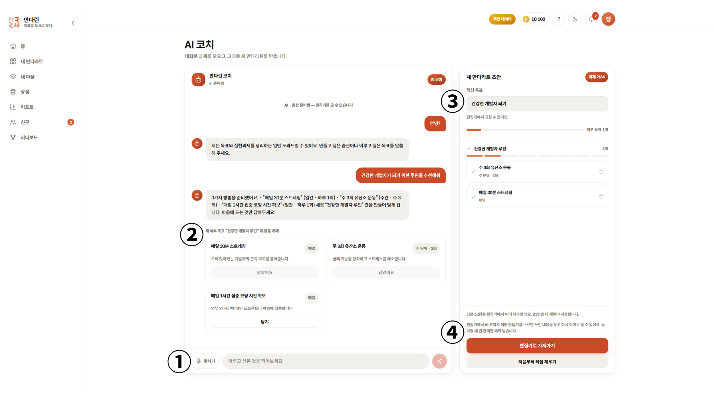
1. 대화 및 음성 입력창
    - '말하기' 버튼을 통해 마이크로 AI 코치와 직접 음성 대화를 나누며 목표를 정립할 수 있습니다.
    - 텍스트 입력창을 통해 원하는 목표나 습관을 직접 적어서 AI 코치에게 전달할 수 있습니다.

2. 대화 세션 및 과제 추천 영역
    - AI 코치와의 실시간 대화 내역 및 목표 구체화를 위한 코칭 메시지를 확인할 수 있습니다.
    - AI가 대화 내용을 기반으로 추천하는 세부 과제 카드를 확인하고 '담기' 버튼을 눌러 만다라트에 추가할 수 있습니다.

3. 새 만다라트 초안 패널
    - AI 대화를 통해 수집된 핵심 목표, 세부 목표 및 과제 현황을 실시간으로 확인할 수 있습니다.
    - 초안에 담긴 과제 항목을 확인하고 불필요한 과제는 삭제할 수 있습니다.

## 2D 만다라트
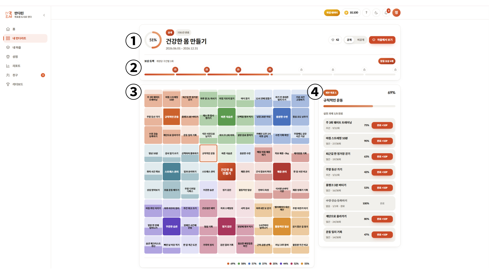
1. 시트 헤더 정보 및 액션 버튼
    - 만다라트의 전체 달성률, 핵심 목표명, 진행 기간, 완료 칸 수 및 좋아요 수를 확인할 수 있습니다.
    - 시트의 공개/비공개 상태를 변경할 수 있으며, '마을에서 보기' 버튼을 통해 해당 시트의 3D 마을 화면으로 이동할 수 있습니다.

2. 마일스톤 보상 트랙
    - 만다라트 달성률 구간 진행 현황을 시각적으로 확인합니다.
    - 목표 구간 달성 시 '받을 보상' 버튼을 눌러 건물 스킨 또는 포인트 보상을 수령할 수 있습니다.

3. 81칸 만다라트
    - 전체 81칸 만다라트 시트의 과제 배치 현황과 하단의 도메인별 달성률을 한눈에 확인할 수 있습니다.
    - 원하는 도메인 구역을 선택하여 우측 패널에서 상세 과제들을 조회할 수 있습니다.

4. 세부 과제 수행 패널
    - 선택한 세부 목표와 소속된 8개 실천 과제의 달성률 및 수행 현황(주기, 횟수)을 확인합니다.
    - 완료 버튼을 눌러 당일 과제를 즉시 완수하고 보상 포인트를 적립할 수 있습니다.

## 3D 만다라트
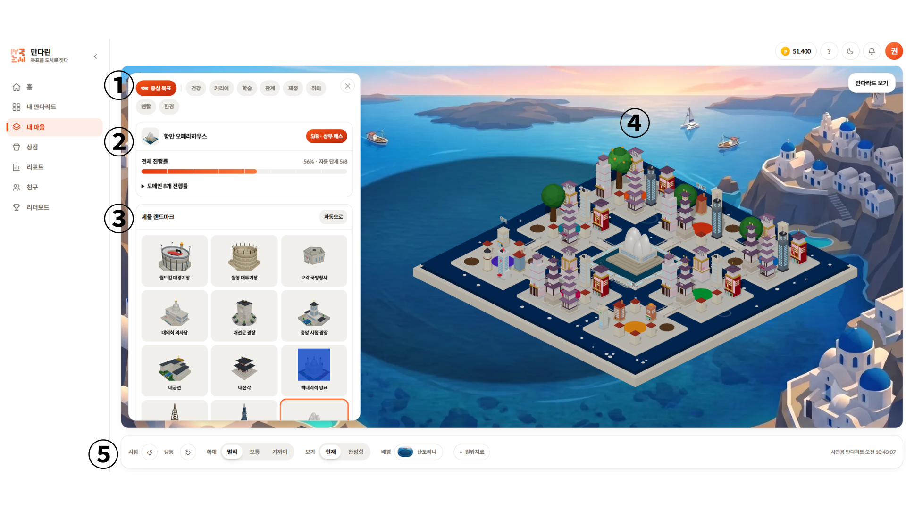
1. 도메인 탭 선택 바
    - 중심 목표 및 8개 세부 도메인 탭을 선택하여 원하는 구역의 건물 스킨을 변경하거나 지정할 수 있습니다.

2. 건물 정보 및 진행률 패널
    - 중심목표의 랜드마크 건물명과 진행률 단계, 시트 전체 진행률을 확인할 수 있습니다.

3. 건물 스킨 선택 패널
    - 보유한 건물 스킨 목록을 확인하고, 원하는 스킨을 선택하여 배치할 수 있습니다.
    - '자동으로' 버튼을 통해 기본 스킨으로 자동 배치할 수 있습니다.

4. 3D 마을 메인 뷰어
    - 과제 완수 및 진행률 상승에 따라 자라나는 3D 건물의 성장 모습을 실시간으로 확인할 수 있습니다.

5. 3D 카메라 & 지형 제어 툴바
    - 카메라 시점 회전(좌/우), 확대/축소(멀리, 보통, 가까이), 입체/평면 보기 모드를 자유롭게 제어할 수 있습니다.
    - 바닥 지형 스킨이나 배경을 변경하거나 '원위치로' 버튼을 통해 시점을 리셋할 수 있습니다.

## 건물배치 변경
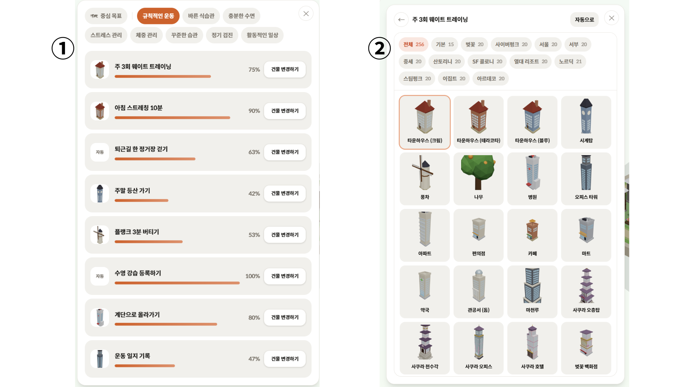
1. 도메인 과제별 건물 현황 패널
    - 3D 마을에서 특정 도메인을 선택했을 때 나타나는 8개 세부 과제 목록 화면입니다.
    - 각 과제에 지정된 현재 건물 스킨, 과제 달성률 및 '건물 변경하기' 버튼을 확인할 수 있습니다.

2. 건물 스킨 변경 패널
    - '건물 변경하기' 버튼을 누르거나 3D 마을에서 변경을 원하는 건물을 직접 클릭했을 때 나타나는 화면입니다.
    - 테마별 필터를 통해 원하는 테마의 건물을 빠르게 검색할 수 있습니다.
    - 다양한 건물 스킨 중 원하는 건물을 클릭하면 해당 3D 위치의 건물 스킨이 즉시 교체 적용됩니다.
    - '자동으로' 버튼을 통해 해당 타일의 건물을 기본 스킨으로 바꿀 수 있습니다.

## 상점
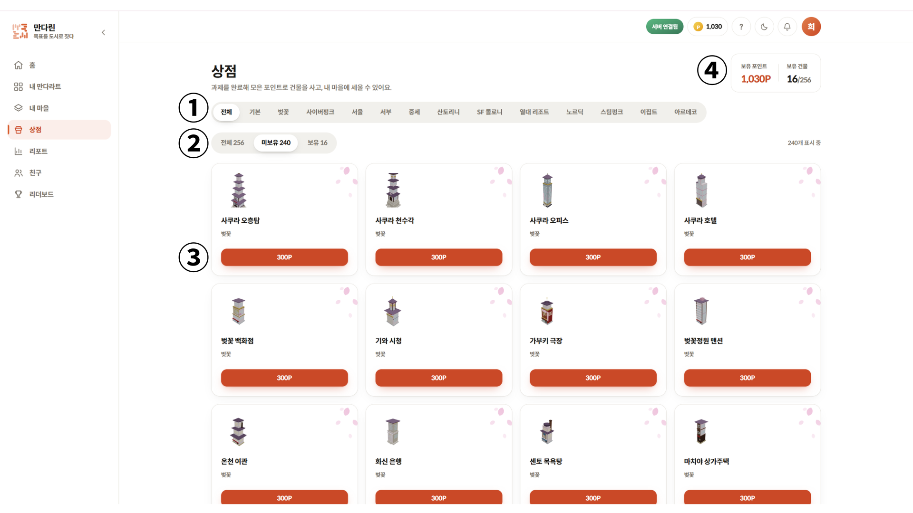
1. 테마 카테고리 필터
    - 다양한 테마별 탭을 선택하여 특정 테마의 건물들을 조회할 수 있습니다.

2. 소유 상태 필터
    - 전체, 미보유, 보유 탭 필터를 통해 건물의 구매 여부별로 분류하여 확인할 수 있습니다.

3. 건물 상품 카탈로그
    - 각 건물의 3D 이미지, 건물명, 소속 테마 및 구매 가격을 확인하고 '300P' 버튼을 클릭하여 보유 포인트로 건물을 구매할 수 있습니다.

4. 보유 포인트 및 건물 현황 요약
    - 사용자가 현재 보유하고 있는 총 포인트와 전체 건물 중 현재 소유한 건물 수를 한눈에 확인할 수 있습니다.

## AI 리포트
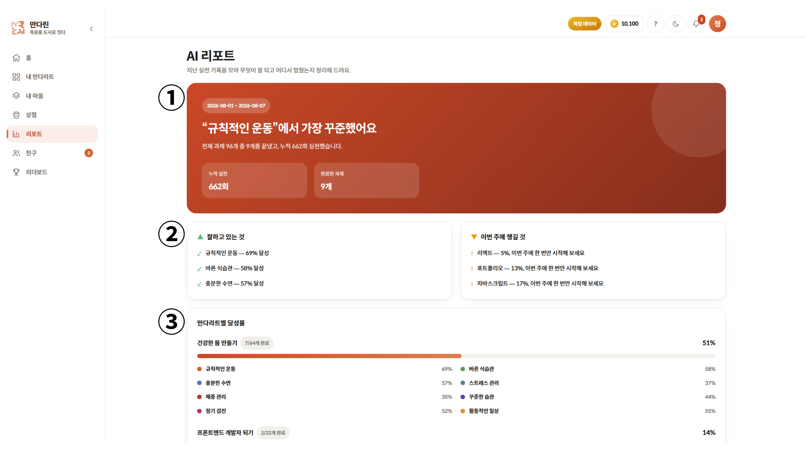
1. 주간 성과 배너
    - 분석 대상 주간 기간과 함께 AI가 분석한 한 줄 주간 실천 성과를 제공합니다.
    - 지난 한 주 동안의 총 누적 실천 횟수와 최종 완료한 과제 수를 확인할 수 있습니다.

2. AI 맞춤 피드백 패널
    - '잘하고 있는 것': 높은 달성률을 기록하여 꾸준히 실천 중인 상위 도메인과 달성률을 보여줍니다.
    - '이번 주에 챙길 것': 상대적으로 실천이 저조한 과제를 파악하여 AI가 이번 주에 실천해 볼 것을 권장하는 동기부여 가이드를 제공합니다.

3. 만다라트별 상세 달성률
    - 사용자가 보유한 만다라트 시트별 전체 달성률과 완료 과제 수를 조회합니다.
    - 각 시트를 구성하는 8개 도메인별 세부 달성률 통계를 한눈에 비교하고 분석할 수 있습니다.

## 친구 목록
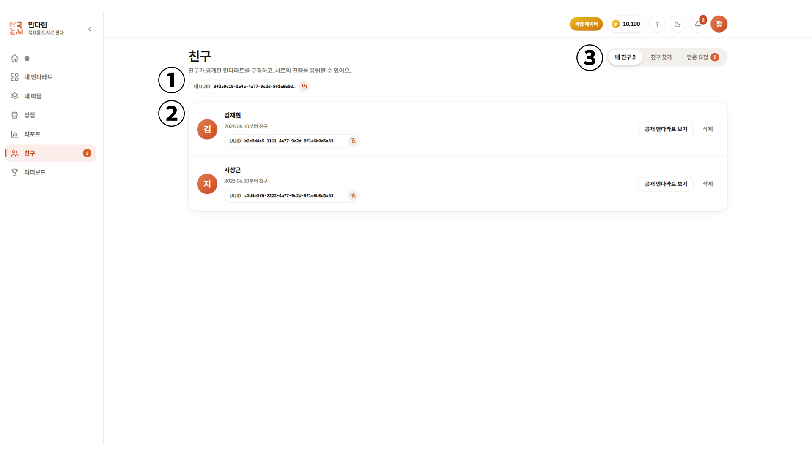
1. 내 UUID 확인
    - 본인의 고유 사용자 식별자인 '내 UUID'를 확인하고 복사할 수 있습니다.

2. 내 친구 목록 패널
    - 현재 등록된 친구들의 이름, 친구 관계 맺은 날짜 및 친구의 UUID 정보를 확인합니다.
    - '공개 만다라트 보기' 버튼을 통해 친구의 공개 만다라트 시트로 바로 이동하여 둘러볼 수 있습니다.
    - '삭제' 버튼을 눌러 지정된 친구 관계를 삭제할 수 있습니다.

3. 친구 메뉴 탭
    - '내 친구': 현재 연결된 친구 목록을 확인하는 탭입니다.
    - '친구 찾기': 상대방의 UUID를 검색하여 새로운 친구 추가 요청을 보낼 수 있는 탭입니다.
    - '받은 요청': 나에게 도착한 친구 요청 목록을 확인하고 수락 또는 거절할 수 있는 탭입니다.

## 리더보드
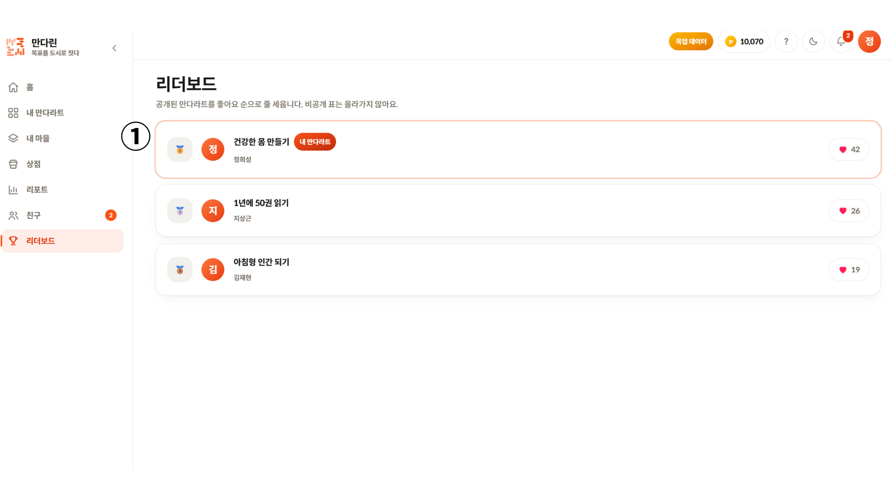
1. 좋아요 순 랭킹 리스트
    - 공개 설정된 만다라트 시트들을 획득한 '좋아요' 수에 따라 순위별로 정렬하여 보여줍니다.
    - 순위 , 작성자 프로필 및 이름, 만다라트 시트 제목, 본인 시트 여부 및 좋아요 수를 확인할 수 있습니다.
    - 만다라트 제목을 클릭하면 해당 공개 만다라트 시트 화면으로 바로 이동할 수 있습니다.

## 마이페이지
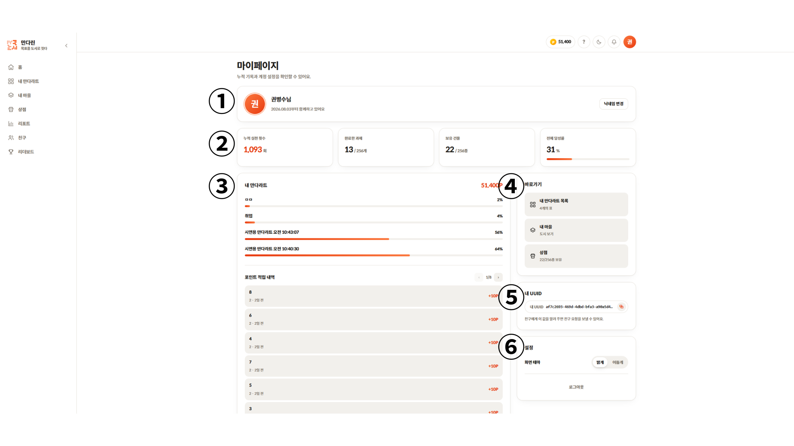
1. 프로필 정보 및 닉네임 변경
    - 사용자의 프로필 이미지, 닉네임 및 서비스 가입일을 확인하고 '닉네임 변경' 버튼을 통해 이름을 수정할 수 있습니다.

2. 누적 성과 지표 패널
    - 누적 실천 횟수, 완료된 과제 수, 보유 건물 종류 수 및 전체 달성률 지표를 요약하여 보여줍니다.

3. 만다라트 진행도 & 포인트 적립 내역
    - 보유 중인 만다라트 시트별 진행도 목록과 과제 수행을 통해 적립된 포인트 내역을 확인할 수 있습니다.

4. 내 UUID 확인 및 복사 영역
    - 본인의 고유 사용자 식별자인 '내 UUID'를 확인하고 복사할 수 있습니다.

5. 로그아웃
    - '로그아웃' 버튼을 통해 계정 세션을 종료할 수 있습니다.
